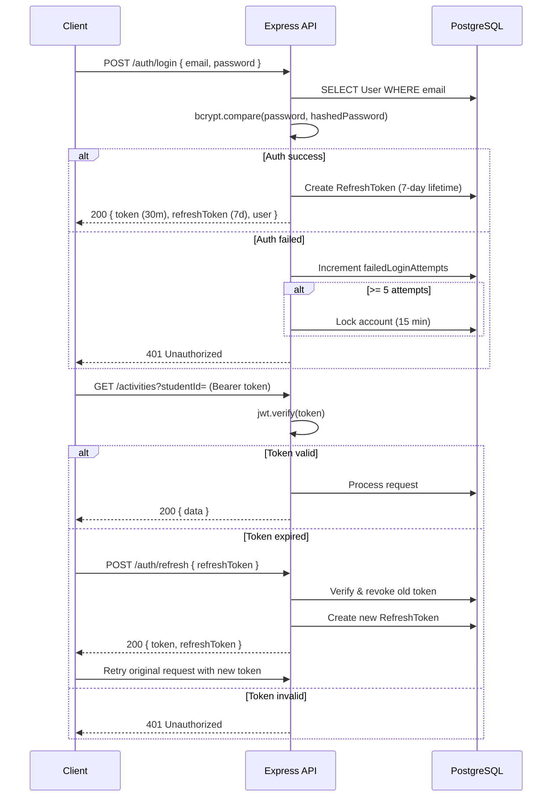

# FieldTrack — System Pitching & Ecosystem Overview

## 📌 Executive Summary

**FieldTrack** is a full-stack digital platform that transforms field-based academic supervision by replacing paper-based field logs with a **GPS-verified, evidence-backed, real-time digital workflow**.

It serves three interconnected user ecosystems:
- **Students** — safely log field activities with geo-tagged evidence
- **Supervisors** — monitor and review student fieldwork in real-time
- **Administrators** — manage users, departments, and institutional oversight

**Key Innovation:** Works seamlessly in low-connectivity rural environments through **offline-first architecture** with automatic synchronization.

---

## 🎯 Problem & Solution

### The Problem
Universities struggle to supervise field-based research activities because:
- Supervisors cannot be physically present with every student
- Paper field logs are laborious, easy to lose, and difficult to audit
- No evidence of when/where/what activities actually occurred
- Supervisors only discover problems weeks after fieldwork ends
- Rural field sites often have poor connectivity

### The Solution
FieldTrack provides:
✅ **GPS-verified check-in/check-out** — cryptographic proof of presence  
✅ **Geo-tagged evidence capture** — images, videos, documents with time/location  
✅ **Real-time monitoring** — supervisors see live student status on an interactive map  
✅ **Structured activity logs** — methodology, objectives, findings, remarks  
✅ **Offline-first design** — works without connectivity, syncs when available  
✅ **Role-based workflows** — students record, supervisors review, admins manage  

---

## 🏗️ System Architecture

### High-Level Overview

```
┌─────────────────────────────────────────────────────────────┐
│                    CLIENTS (Presentation)                  │
│  Flutter Student Portal | Supervisor Portal | Admin Portal │
│  + Flutter Web Dashboard                                    │
└────────────────────────┬────────────────────────────────────┘
                         │ HTTPS / REST API
                         ↓
┌─────────────────────────────────────────────────────────────┐
│              EDGE LAYER (Nginx Reverse Proxy)               │
│  • SSL/TLS Termination  • Static File Serving  • Caching    │
└────────────────────────┬────────────────────────────────────┘
                         │ HTTP (local)
                         ↓
┌─────────────────────────────────────────────────────────────┐
│        APPLICATION LAYER (Express.js API :3000)             │
│  • JWT Authentication  • Role-Based Access Control (RBAC)   │
│  • Input Validation    • Rate Limiting                      │
│  • Error Handling      • Structured Logging (Winston)       │
└────────────────────────┬────────────────────────────────────┘
                         │
        ┌────────────────┴────────────────┐
        ↓                                 ↓
┌──────────────────┐            ┌────────────────────┐
│  PostgreSQL DB   │            │  Storage Layer     │
│  (Prisma ORM)    │            │  (Local/S3)        │
│                  │            │  • Avatar images   │
│  • Users         │            │  • Documents       │
│  • Sessions      │            │  • Videos          │
│  • Activities    │            │  • Attachments     │
│  • Reviews       │            └────────────────────┘
│  • Audit Logs    │
└──────────────────┘
```

### Technology Stack

| Layer | Technology | Purpose |
|-------|-----------|---------|
| **Frontend** | Flutter (Dart) | Cross-platform mobile & web apps |
| **Backend** | Express.js (Node.js) | REST API server |
| **Database** | PostgreSQL + Prisma ORM | Relational data persistence |
| **Authentication** | JWT (HS256) | Stateless token-based auth |
| **Storage** | Local filesystem / S3 | Media files & attachments |
| **Server** | Nginx (reverse proxy) | SSL termination, load balancing |
| **Process** | PM2 (cluster mode) | Application clustering & monitoring |
| **Messaging** | Firebase Cloud Messaging | Push notifications |

### Deployment Architecture

```
┌─────────────────┐
│  Load Balancer  │
│   (Optional)    │
└────────┬────────┘
         │
    ┌────┴────┐
    ↓         ↓
┌─────────┐ ┌─────────┐
│ Nginx   │ │ Nginx   │ (Multiple instances)
│ :443    │ │ :443    │
└────┬────┘ └────┬────┘
     │           │
     └───┬───────┘
         ↓
    ┌─────────────────────────┐
    │  Express.js Cluster     │
    │  (PM2, multiple workers)│
    └────────────┬────────────┘
                 │
      ┌──────────┴──────────┐
      ↓                     ↓
   [PostgreSQL]        [Storage]
   [Replication]    [Backup/Archive]
```

---

## 👥 Ecosystem Overview: Three Interconnected Flows

### Role Structure
- **STUDENT** — Records field activities
- **SUPERVISOR** — Reviews and approves student work
- **ADMIN** — Manages system, users, and institutional settings

Each user has:
- Unique JWT authentication token (30-minute lifetime)
- Role-based endpoint access (RBAC)
- Profile with role-specific data
- Real-time notifications

---

## 🎓 Student Ecosystem Flow

### Student Journey

```
┌─────────────┐
│    Login    │
└──────┬──────┘
       │ (Email + Password)
       ↓
┌─────────────────────────┐
│  Dashboard & Overview   │
│ • Status (In Field/Out) │
│ • Hours Logged          │
│ • Pending Approvals     │
│ • Quick Actions         │
└──────┬──────────────────┘
       │
    ┌──┴────────────────────────────┐
    ↓                               ↓
┌──────────────────┐      ┌────────────────────┐
│  Check-In        │      │  Create Activity   │
│  (GPS-Verified)  │      │  (While In Field)  │
│ • Capture lat/lng│      │ • Title            │
│ • Accuracy check │      │ • Methodology      │
│ • Start timer    │      │ • Objectives       │
│ • Session ID     │      │ • Findings         │
└────────┬─────────┘      │ • Remarks          │
         │                │ • Location         │
         │                └────────┬───────────┘
         │                         │
         │    ┌────────────────────┘
         │    ↓
         │  ┌──────────────────────────┐
         │  │  Upload Evidence         │
         │  │  • Photos (geo-tagged)   │
         │  │  • Videos (geo-tagged)   │
         │  │  • Documents             │
         │  │ Auto-compress on upload  │
         │  └────────┬─────────────────┘
         │           │
         │  ┌────────┴────────┐
         │  ↓                 ↓
         │ [Offline Queue]  [Upload]
         │ (Hive Local DB)  (to API)
         │  │                 │
         │  └────────┬────────┘
         │           ↓
         │  ┌──────────────────┐
         │  │ Submit Activity  │
         │  │ for Review       │
         │  │ Status: SUBMITTED│
         │  └────────┬─────────┘
         │           │
         └───────┬───┘
                 ↓
         ┌─────────────────┐
         │  Check-Out      │
         │  (GPS-Verified) │
         │ • End lat/lng   │
         │ • End timer     │
         │ • Close session │
         └────────┬────────┘
                  │
                  ↓
         ┌────────────────────┐
         │ Wait for Supervisor│
         │ Review             │
         │ Status: UNDER_REV. │
         └────────┬───────────┘
                  │
            ┌─────┴──────┬──────────┐
            ↓            ↓          ↓
    ┌─────────────┐ ┌────────┐ ┌──────────┐
    │  APPROVED   │ │REVISION│ │ REJECTED │
    │    ✓        │ │REQUESTED│ │  ✗      │
    └─────────────┘ └───┬────┘ └────┬─────┘
                        │           │
                        └─────┬─────┘
                              ↓
                    ┌──────────────────┐
                    │ Edit & Resubmit  │
                    │ (Repeat cycle)   │
                    └──────────────────┘
```

### Student Portal Features

#### 1. **Authentication** (`features/auth/`)
| Screen | Purpose |
|--------|---------|
| Login | Email/registration # + password |
| Forgot Password | OTP-based reset |
| OTP Verification | 6-digit verification |
| Force Password Change | First-login mandatory |

#### 2. **Dashboard** (`features/dashboard/`)
- Summary: Hours logged, approvals, recent activities
- Quick actions: Check-in, new activity, view map
- Status indicator: In-field or checked-out

#### 3. **Check-In / Field Session** (`features/checkin/`, `features/field_session/`)
- **Requires valid GPS fix** (no check-in without location)
- Captures: latitude, longitude, accuracy metadata
- Starts elapsed timer
- Creates active session record

#### 4. **Activity Logging** (`features/activities/`)
- Create/edit structured field logs:
  - **Title** — Activity name
  - **Description** — Overview
  - **Methodology** — How it was conducted
  - **Objectives** — Goals
  - **Findings** — Results observed
  - **Remarks** — Additional notes
  - **Location** — GPS coordinates

**Lifecycle:**
```
DRAFT → SUBMITTED → UNDER_REVIEW → (APPROVED | REVISION_REQUESTED | REJECTED) → RESUBMITTED
```

#### 5. **Evidence Upload** (`features/activities/evidence/`)
- **Image Picker** — Gallery or camera
- **Video Recording** — Built-in recorder
- **Document Picker** — File attachments
- **Automatic metadata:**
  - Timestamp
  - GPS coordinates
  - Compression (images/videos)

#### 6. **Offline Support**
- **Offline Queue (Hive):** Non-GET requests queued when offline
- **Automatic Replay:** Syncs on reconnection
- **Status Indicators:** Shows sync pending / synced / failed

#### 7. **Notifications** (`features/notifications/`)
- In-app notification list (read/unread)
- Push notifications via Firebase
- Review decisions (approved, rejected, revisions requested)

#### 8. **Map & Location** (`features/map/`)
- Current position on `flutter_map`
- Session history visualization
- Breadcrumb trail of check-in/out locations

#### 9. **Profile & Settings** (`features/profile/`)
- User information
- Avatar upload
- Preferences: notifications, theme, date format
- Security settings
- Session management

### Student API Endpoints

| Action | Method | Endpoint |
|--------|--------|----------|
| Login | POST | `/auth/login` |
| Get profile | GET | `/auth/me` |
| Check-in | POST | `/sessions/checkin` |
| Check-out | PATCH | `/sessions/checkout` |
| Active session | GET | `/sessions/active?studentId=` |
| Location ping | POST | `/sessions/ping` |
| Create activity | POST | `/activities` |
| List activities | GET | `/activities/student/all?studentId=` |
| Submit activity | POST | `/activities/:id/submit` |
| Upload media | POST | `/media/upload` |
| Get notifications | GET | `/notifications` |
| Mark read | PATCH | `/notifications/:id/read` |
| Update settings | PUT | `/settings/preferences` |

---

## 👨‍🏫 Supervisor Ecosystem Flow

### Supervisor Journey

```
┌─────────────┐
│    Login    │
│   (Email +  │
│  Password)  │
└──────┬──────┘
       │
       ↓
┌──────────────────────────────┐
│    Supervisor Dashboard      │
│ • Students in field (live)   │
│ • Checked in/out stats       │
│ • Pending approvals          │
│ • Activity trends            │
│ • Recent submissions         │
│ • System notifications       │
└──────┬───────────────────────┘
       │
    ┌──┴────────────────┬──────────────┐
    ↓                   ↓              ↓
┌─────────────┐  ┌────────────┐  ┌─────────────┐
│View Students│  │Live Map    │  │Reports      │
│             │  │            │  │             │
│ • List all  │  │ • Real-time│  │ • Weekly    │
│   assigned  │  │   markers  │  │ • Monthly   │
│   students  │  │ • Zoom/Pan │  │ • Quarterly │
│ • Status    │  │ • Accuracy │  │ • Annual    │
│ • Last      │  │   circles  │  │ • Trends    │
│   activity  │  │ • GeoJson  │  │ • Charts    │
└─────┬───────┘  └────────────┘  └─────────────┘
      │
      ↓
┌──────────────────────┐
│Student Profile       │
│ • Sessions (list)    │
│ • Activities (all)   │
│ • Statistics:        │
│   - Total field days │
│   - Total activities │
│   - Evidence count   │
│   - Distance traveled│
│   - GPS accuracy avg │
│ • Timeline view      │
└──────┬───────────────┘
       │
       ↓
┌───────────────────────────┐
│ View Activity Details     │
│ • All metadata            │
│ • Full evidence gallery   │
│ • Student remarks         │
│ • Location pinpoint       │
└──────┬────────────────────┘
       │
       ↓
┌────────────────────────────┐
│ REVIEW & DECIDE            │
│ (Supervisor Action)        │
│                            │
│ • Add rating (1-5 stars)   │
│ • Write comments           │
│ • Choose decision:         │
└──────┬──────┬──────┬───────┘
       │      │      │
    ┌──┘      │      └──┐
    ↓         ↓         ↓
┌────────┐┌──────────┐┌────────┐
│APPROVED││REVISION  ││REJECTED│
│  ✓     ││REQUESTED ││  ✗     │
└────────┘└──────────┘└────────┘
    │         │         │
    └────┬────┴────┬────┘
         ↓
    ┌──────────────────────────┐
    │ Activity Status Updated  │
    │ • Notification sent to   │
    │   student               │
    │ • Feedback visible to   │
    │   student               │
    │ • Analytics updated     │
    └──────────────────────────┘
```

### Supervisor Portal Features

#### 1. **Authentication** (`features/supervisor/authentication/`)
- Login with email + password
- Forgot password (OTP-based)
- Password reset
- Role guard: `/supervisor/*` requires `SUPERVISOR` or `ADMIN` role

#### 2. **Dashboard** (`features/supervisor/dashboard/`)
- **Live Stats:**
  - Students in field (real-time)
  - Checked in/out count
  - Pending approvals count
  - Recent submissions
  - Trend charts (activity, submissions, attendance)
  - Department breakdowns
- **Quick Actions:** View map, create user (if admin), access reports

#### 3. **Students Management** (`features/supervisor/students/`)
- **List screen:**
  - All assigned students
  - Live status indicator (In Field / Checked Out / Idle)
  - Last activity timestamp
  - Quick actions: View profile, contact
- **Student profile deep-dive:**
  - Total field days logged
  - Total activities submitted
  - Evidence statistics
  - Distance travelled (GPS aggregate)
  - Average GPS accuracy
  - Timeline of sessions & activities
  - Recent sessions with timestamps

#### 4. **Activity Review** (`features/supervisor/review/`)
- **Review workflow:**
  1. Select activity to review
  2. View all metadata (student info, location, timestamp)
  3. Inspect evidence gallery (images, videos, documents)
  4. Read activity details (methodology, findings, remarks)
  5. Leave rating (1-5 stars)
  6. Write comments
  7. Submit decision:
     - ✅ **APPROVED** — Student's work accepted
     - 📝 **REVISION_REQUESTED** — Ask for clarification/edits
     - ❌ **REJECTED** — Does not meet standards
  8. Student receives notification with feedback
  9. Can revise & resubmit if requested/rejected

#### 5. **Evidence Inspection** (`features/supervisor/evidence/`)
- Full-screen gallery of uploaded media
- Zoom/pan images
- Play videos with metadata
- Download or export

#### 6. **Field Logs** (`features/supervisor/field_logs/`)
- Daily field log view for each student
- Chronological activity list per day
- Quick evidence preview
- Status badges (draft, submitted, approved, etc.)

#### 7. **Live Location Tracking** (`features/supervisor/location/`)
- **Location history (pings):**
  - GPS coordinates every N seconds (configurable)
  - Accuracy metadata
  - Timeline visualization
  - Breadcrumb trail on map
- **Student position now:**
  - Last known GPS
  - Accuracy circle
  - Timestamp of last update

#### 8. **Live Map** (`features/supervisor/map/`)
- Interactive map of all assigned students
- Real-time markers with student names
- Accuracy circles (GPS uncertainty)
- Zoom/pan/search
- Session status indicator (active/inactive)

#### 9. **Reports** (`features/supervisor/reports/`)
- **Time period filters:**
  - This Week
  - This Month
  - This Quarter
  - This Year
- **Report content:**
  - Period summary (students, activities, hours)
  - Methodology gauge (activity types breakdown)
  - Trend chart (submissions over time)
  - Recent activities feed
  - Log summary table
  - Export/print support

#### 10. **Settings & Preferences** (`features/supervisor/settings/`)
- Notification preferences (push, email, SMS)
- Security settings (2FA, password change)
- UI preferences (theme, date format, map defaults)
- Help & documentation

### Supervisor API Endpoints

| Action | Method | Endpoint |
|--------|--------|----------|
| Login | POST | `/auth/login` |
| Dashboard stats | GET | `/dashboard/supervisor` |
| Quick stats | GET | `/supervisor/dashboard/stats` |
| Students list | GET | `/supervisor/students` |
| Student profile | GET | `/supervisor/students/:id` |
| Student GPS pings | GET | `/sessions/student/:studentId/pings` |
| Activity details | GET | `/activities/:id` |
| Submit review | POST | `/reviews` |
| Generate report | GET | `/reports/supervisor?period=This+Month` |
| Notifications | GET | `/notifications` |

---

## 🛠️ Admin Ecosystem Flow

### Administrator Journey

```
┌─────────────┐
│    Login    │
│   (Email +  │
│  Password)  │
└──────┬──────┘
       │ (Requires ADMIN role)
       ↓
┌────────────────────────────────────┐
│   Admin Dashboard                  │
│ (Institution-wide Analytics)       │
│ • Total students / supervisors     │
│ • Students in field now            │
│ • Submissions (today/week/month)   │
│ • Pending reviews                  │
│ • Active research projects         │
│ • Activity trends (line chart)     │
│ • Submission status breakdown      │
│ • Department statistics            │
│ • Recent system activities (audit) │
└──────┬───────────────────────────────┘
       │
    ┌──┴─────────┬────────────┬──────────┬─────────┬──────────────┐
    ↓            ↓            ↓          ↓         ↓              ↓
┌────────────┐ ┌──────────┐ ┌────────┐ ┌──────┐ ┌─────────┐ ┌────────────┐
│User Mgmt   │ │Departments│ │Projects│ │Map   │ │Reports  │ │Settings    │
│            │ │           │ │        │ │      │ │         │ │            │
│ • Create   │ │ • View    │ │ • List │ │ • RT │ │ • Period│ │ • Institution│
│   students │ │   all     │ │   all  │ │   map│ │   filter│ │   info     │
│ • Create   │ │ • Create  │ │ • View │ │ • All│ │ • Trends│ │ • JWT      │
│   supervisors│ │ • Edit    │ │   detail│ │sessions│ │ • Charts│ │   settings │
│ • Edit     │ │ • Manage  │ │ • Track│ │      │ │         │ │ • GPS      │
│   profiles │ │   count   │ │   status│ │      │ │         │ │   radius   │
│ • Reset    │ │ • View    │ │        │ │      │ │         │ │ • SMTP    │
│   password │ │   students│ │        │ │      │ │         │ │ • Backup   │
│ • Reassign │ │   per     │ │        │ │      │ │         │ │ • Security │
│   supervisor│ │   dept    │ │        │ │      │ │         │ │   thresholds│
│ • Archive  │ │ • View    │ │        │ │      │ │         │ │ • S3       │
│   users    │ │   projects│ │        │ │      │ │         │ │ • Slack    │
└────────────┘ └──────────┘ └────────┘ └──────┘ └─────────┘ └────────────┘
    │
    ↓
┌──────────────────────────────────┐
│ Notifications & Broadcast        │
│ • View recent notifications      │
│ • Create broadcast announcement  │
│ • Send to: all / dept / role     │
└──────────────────────────────────┘
    │
    ↓
┌──────────────────────────────────┐
│ Audit Logs                       │
│ • Full action history            │
│ • Actor, affected user, IP       │
│ • Timestamp, details             │
│ • Searchable/filterable          │
└──────────────────────────────────┘
```

### Admin Portal Features

#### 1. **Authentication** (`features/admin/auth/`)
- Login with email + password
- Forgot password (OTP-based)
- Password reset
- Role guard: All `/admin/*` endpoints require `ADMIN` role

#### 2. **Dashboard** (`features/admin/dashboard/`)
- **Institution-wide Analytics:**
  - Total users (students, supervisors, admins)
  - Students in field (real-time count)
  - Checked-in/checked-out breakdown
  - Submissions: today, this week, this month
  - Pending reviews (awaiting supervisor action)
  - Active research projects
- **Visualizations:**
  - Activity submission trends (line chart)
  - Submission status breakdown (pie/bar)
  - Department stats (students, supervisors, activity)
  - Attendance heatmap
- **Quick feeds:**
  - Recent user creations
  - Recent activity submissions
  - System alerts

#### 3. **User Management** (`features/admin/users/`)

**User List Screen:**
- Search by name/email/registration #
- Filter by role (student, supervisor, admin)
- Filter by status (active, pending, disabled, suspended, locked, archived)
- Sort by created date, last login, status
- Quick actions: Edit, reset password, view profile

**Create User:**
- **Student creation:**
  - Name, email, registration #
  - Phone, avatar
  - Department, faculty, programme
  - Assign supervisor
  - Auto-generate temporary password
  - System sends email with credentials
- **Supervisor creation:**
  - Name, email, staff #
  - Department
  - Auto-generate temporary password

**Edit User:**
- Update profile fields
- Change department
- Reassign supervisor (for students)
- Update status (active → suspended, etc.)
- Reset password (generates OTP)
- Archive account (soft-delete)

**User Profile View:**
- Full account info
- Role-specific details (student topic, supervisor capacity)
- Statistics (activities, hours, approvals)
- Login history
- Account status timeline
- Action history (admin changes)

#### 4. **Departments** (`features/admin/departments/`)
- **List view:**
  - All departments
  - Student count per department
  - Supervisor count per department
  - Active projects per department
- **Create department:**
  - Name, code, faculty
  - Head/coordinator assignment
- **Department detail:**
  - Drill-down by department
  - List of students
  - List of supervisors
  - List of projects
  - Statistics (active field sessions, submissions)

#### 5. **Projects** (`features/admin/projects/`)
- Research projects management
- Project details:
  - Title, description
  - Assigned students
  - Assigned supervisor
  - Start/end dates
  - Progress indicator
  - Status (active, archived, completed)

#### 6. **Live Map** (`features/admin/map/`)
- **Institution-wide field activity map**
  - All active field sessions
  - Real-time student markers
  - Accuracy circles
  - Department color-coding
  - Drill-down by session (student name, time in field, activities count)
- **Zooming & filtering:**
  - Filter by department
  - Filter by supervisor
  - Filter by status (active, completed)

#### 7. **Notifications & Broadcast** (`features/admin/notifications/`)
- **View notifications:**
  - Recent system alerts
  - Status change notifications
  - Error logs
- **Broadcast announcement:**
  - Compose message
  - Select recipients:
    - All users
    - By department
    - By role (students, supervisors)
    - Specific users
  - Send immediately or schedule
  - Track delivery status

#### 8. **Audit Logs** (`features/admin/audit/`)
- **Complete audit trail:**
  - Actor (admin who performed action)
  - Action type (create, update, delete, reset, etc.)
  - Affected user
  - Details (old value → new value)
  - Timestamp
  - IP address & user-agent
- **Search & filter:**
  - By actor
  - By action type
  - By date range
  - By affected user
- **Pagination:** 50 entries per page

#### 9. **Reports** (`features/admin/reports/`)
- Institution-wide reporting
- Period filters (week, month, quarter, year)
- Export capabilities (PDF, CSV)
- Metrics:
  - Submission rates
  - Approval rates
  - Student engagement
  - Supervisor workload
  - Department performance

#### 10. **Settings** (`features/admin/settings/`)
- **Institution Info:**
  - University name
  - Logo, branding
  - Contact info
- **System Configuration:**
  - Session timeout duration
  - GPS deviation radius (for field validation)
  - Offline sync interval
  - Max upload file size
  - Evidence retention policy
- **SMTP Configuration:**
  - Email server (for OTP, reset, notifications)
  - From address, templates
- **Backup & Recovery:**
  - Backup schedule
  - Retention days
  - Restore options
- **Security Thresholds:**
  - Failed login attempts before lock (default: 5)
  - Account lock duration (default: 15 min)
  - Password policy (min length, complexity)
  - 2FA enforcement toggle
- **Integrations:**
  - S3 bucket URI (for media storage)
  - Firebase project config
  - Slack webhook (for alerts)
  - SSO configuration (if enabled)

### Admin API Endpoints

| Action | Method | Endpoint |
|--------|--------|----------|
| Login | POST | `/auth/login` |
| Dashboard | GET | `/dashboard/admin?period=` |
| Create student | POST | `/admin/users/students` |
| Create supervisor | POST | `/admin/users/supervisors` |
| List users | GET | `/admin/users` |
| User detail | GET | `/admin/users/:id` |
| Update user | PUT | `/admin/users/:id` |
| Change status | PATCH | `/admin/users/:id/status` |
| Reassign supervisor | PATCH | `/admin/users/:id/supervisor` |
| Reset password | POST | `/admin/users/:id/reset-password` |
| Archive user | DELETE | `/admin/users/:id` |
| Departments list | GET | `/admin/departments` |
| Create department | POST | `/admin/departments` |
| Department detail | GET | `/admin/departments/:id` |
| Projects list | GET | `/admin/projects` |
| Global search | GET | `/admin/search?q=` |
| Audit logs | GET | `/admin/audit-logs` |
| Broadcast | POST | `/admin/notifications/broadcast` |
| Settings get | GET | `/admin/settings` |
| Settings update | PUT | `/admin/settings` |
| Live map | GET | `/admin/map` |

---

## 🔐 Authentication & Authorization

### Authentication Flow



### Token Details

- **Access Token (JWT):**
  - Algorithm: HS256 (symmetric, signed with JWT_SECRET)
  - Lifetime: **30 minutes**
  - Payload:
    ```json
    {
      "userId": "uuid",
      "role": "STUDENT|SUPERVISOR|ADMIN",
      "email": "user@institution.edu",
      "iat": 1730000000,
      "exp": 1730001800
    }
    ```

- **Refresh Token:**
  - Lifetime: **7 days**
  - Stored in database (`RefreshToken` table)
  - Rotated on every refresh call (old token revoked)
  - Revoked on: logout, password change, account suspension, admin reset

### Role-Based Access Control (RBAC)

| Endpoint Group | STUDENT | SUPERVISOR | ADMIN |
|---|:---:|:---:|:---:|
| `/auth/*` (own session) | ✅ | ✅ | ✅ |
| `/sessions/*` (own) | ✅ | – | – |
| `/activities/*` (own) | ✅ | – | – |
| `/supervisor/*` | – | ✅ | ✅ |
| `/reviews` | – | ✅ | – |
| `/reports/supervisor` | – | ✅ | ✅ |
| `/dashboard/admin` | – | – | ✅ |
| `/admin/*` | – | – | ✅ |
| `/notifications` | ✅ | ✅ | ✅ |
| `/settings/*` | ✅ | ✅ | ✅ |

### Authorization Middleware

```javascript
// Example: Protect supervisor routes
router.use(authenticate);           // Verify JWT
router.use(authorizeRole(['SUPERVISOR', 'ADMIN']));  // Check role
```

---

## 🌐 Ecosystem Integration Points

### How Students & Supervisors Connect

```
┌──────────────────┐
│   STUDENT        │
│                  │
│ 1. Logs activity │
│ 2. Uploads media │
│ 3. Submits for   │
│    review        │
└────────┬─────────┘
         │
         │ Activity created in DB
         │ Notification triggered
         │
         ↓
┌──────────────────────────────┐
│  DATABASE                    │
│  • Activity record created   │
│  • Evidence linked           │
│  • Status: SUBMITTED         │
│  • Notification queued       │
└────────┬─────────────────────┘
         │
         │ Push notification
         │
         ↓
┌───────────────────────────────┐
│   SUPERVISOR                  │
│                               │
│ 1. Receives push notification │
│ 2. Opens activity review      │
│ 3. Views evidence             │
│ 4. Submits rating + feedback  │
│ 5. Activity status updated    │
└───────┬───────────────────────┘
        │
        │ Review record created
        │ Notification sent
        │
        ↓
┌──────────────────────────────────┐
│   STUDENT                        │
│                                  │
│ 1. Receives push notification    │
│ 2. Views feedback from supervisor│
│ 3. Sees decision (approved, etc.)│
│ 4. May revise if requested       │
└──────────────────────────────────┘
```

### How Admins Oversee Everything

```
┌─────────────────────────────────────────┐
│        ADMIN OVERSIGHT LAYER            │
│                                         │
│ Real-time visibility into:              │
│ • All user actions (via audit logs)     │
│ • All active field sessions (live map)  │
│ • All submissions & reviews             │
│ • Department-level metrics              │
│ • System health & performance           │
└────────────────┬────────────────────────┘
                 │
    ┌────────────┼────────────┐
    ↓            ↓            ↓
┌────────┐  ┌─────────┐  ┌──────────┐
│Students│  │Supervisors│ │Departments│
│ • Can  │  │ • Can   │  │ • Can    │
│   create│  │   manage│  │   view   │
│   users │  │   reports│ │   all    │
│ • Can  │  │ • Can   │  │   metrics │
│   reset │  │   broadcast│
│   passwords│ │         │
│ • Can  │  │         │  │
│   reassign│ │         │  │
│   supervisors│
│ • Can  │  │         │  │
│   archive│ │         │  │
└────────┘  └─────────┘  └──────────┘
```

---

## 📡 Data Synchronization & Offline Support

### Offline-First Queue System

```
┌──────────────────┐
│  Flutter Client  │
│                  │
│ ┌──────────────┐ │
│ │Dio HTTP      │ │
│ │Client with   │ │
│ │Interceptors  │ │
│ └────┬─────────┘ │
│      │           │
│      ↓           │
│ ┌──────────────┐ │
│ │Connectivity  │ │
│ │Check         │ │
│ └────┬─────────┘ │
│      │           │
│      ├─ ONLINE ──→ Send to API
│      │            (immediate)
│      │
│      └─ OFFLINE ──→ Queue to Hive
│                    (local DB)
│                    Return 202
│                    (Accepted)
│
│ ┌──────────────┐ │
│ │Hive Offline  │ │
│ │Queue         │ │
│ │• Activity    │ │
│ │• Media       │ │
│ │• Sessions    │ │
│ └──────────────┘ │
└──────────────────┘
     │
     │ On reconnect:
     │ 1. Detect connectivity
     │ 2. Replay queued requests
     │ 3. Server processes as if
     │    received at send time
     │ 4. Clear queue
     │
     ↓
┌──────────────┐
│  Express API │
│              │
│  Database    │
└──────────────┘
```

### Synchronization Behavior

| Scenario | Behavior |
|----------|----------|
| **Online, create activity** | POST immediately → API → DB → Response |
| **Offline, create activity** | Queue locally → Return 202 → Hive stores |
| **Still offline, list activities** | Read from Hive cache + API results |
| **Go online** | Replay queued requests → API processes → DB updates |
| **Conflict detection** | Server validates timestamps; recent changes win |

---

## 📊 Data Model Overview

### Core Entities

```
USER (id, role, email, name, password, status)
├── StudentProfile (registrationNo, topic, supervisorId)
├── SupervisorProfile (staffNumber)
├── RefreshToken (token, expiresAt, isRevoked)
├── UserPreferences (theme, notifications, language)
└── AuditLog (action, details, ipAddress)

FieldSession (studentId, checkInAt, checkOutAt, status)
├── LocationPing (latitude, longitude, accuracy, timestamp)
└── Activity (title, methodology, objectives, findings, remarks)
    ├── Evidence (type, url, gpsCoords, uploadedAt)
    └── Review (rating, comments, decision, supervisorId)

Notification (userId, type, message, isRead)
Department (name, code)
SystemSetting (key, value)
```

---

## 🎯 Key Features & Benefits

### For Students
✅ **Easy field logging** — Structured forms, minimal friction  
✅ **Evidence at hand** — Photos, videos, documents with location  
✅ **Offline capability** — Work without internet, sync later  
✅ **Quick feedback** — See supervisor comments in real-time  
✅ **Transparent status** — Know exactly where submissions stand  

### For Supervisors
✅ **Real-time oversight** — Live map of student locations  
✅ **Structured review** — Clear activity details, evidence galleries  
✅ **Ratings & comments** — Provide meaningful feedback  
✅ **Trend analysis** — Weekly/monthly/quarterly reports  
✅ **Reduced workload** — Organized data vs. paper logs  

### For Administrators
✅ **Full visibility** — Institution-wide metrics, audit trails  
✅ **User management** — Easy onboarding, role assignment  
✅ **System control** — Settings, backups, integrations  
✅ **Compliance** — Complete audit logs for accountability  
✅ **Scalability** — Clustered API, database replication  

### For Institution
✅ **Evidence authenticity** — GPS-verified, time-stamped data  
✅ **Cost reduction** — Eliminate paper, reduce admin overhead  
✅ **Accountability** — Transparent student engagement  
✅ **Reportability** — Generate compliance reports easily  
✅ **Reusability** — Open-source, self-hosted, multi-tenant ready  

---

## 🚀 Technical Highlights

### Reliability
- **Offline-first architecture** — Works without internet
- **Retry logic** — Automatic replay of failed requests
- **Data validation** — Zod schema enforcement client & server
- **Error handling** — Structured error responses with context

### Security
- **JWT-based auth** — Stateless, scalable authentication
- **RBAC enforcement** — Role-based endpoint access
- **Password policy** — Bcrypt hashing (cost 12), OTP-based reset
- **Account lockout** — 5 failed attempts → 15-min lock
- **Audit logging** — Every sensitive action tracked
- **HTTPS/TLS** — Nginx SSL termination

### Performance
- **Database optimizations** — Prisma ORM with connection pooling
- **Caching strategy** — Client-side Hive cache for offline
- **Image compression** — Automatic media optimization
- **Pagination** — Large result sets split into pages
- **API clustering** — PM2 multi-worker load distribution

### Extensibility
- **Multi-tenant ready** — Departmental isolation (future)
- **Pluggable storage** — Local filesystem or S3
- **Notification hooks** — Firebase Cloud Messaging
- **API-first design** — Any client can consume API
- **Audit trail** — Complete history for compliance

---

## 📈 Deployment & Operations

### Deployment Model
- **On-premises:** Self-hosted PostgreSQL, Nginx, Express
- **Cloud:** AWS, Google Cloud, Azure (via containerization)
- **Scalability:** Horizontal scaling of API layer via PM2/load balancer

### Monitoring & Logging
- **Application logs:** Winston structured logging
- **Database logs:** PostgreSQL query logs
- **Audit trail:** Complete user action history in DB
- **Health checks:** Nginx health endpoints
- **Error tracking:** Error logs with stack traces

### Backup & Recovery
- **Database backups:** Automated snapshots
- **Media backups:** Archive to S3/cold storage
- **Recovery procedure:** Point-in-time restore
- **Retention policy:** Configurable in admin settings

---

## 🎓 Use Cases

### Use Case 1: Field Research Supervision
**Scenario:** Environmental science students conduct field surveys in rural locations with spotty connectivity.

**FieldTrack Solution:**
1. Student checks in at site (GPS captured)
2. Records observations offline
3. Takes geo-tagged photos
4. Reconnects (auto-sync)
5. Supervisor approves from office in real-time
6. Admin generates quarterly report

### Use Case 2: Compliance Auditing
**Scenario:** University auditor needs to verify field activities for accreditation.

**FieldTrack Solution:**
1. Admin pulls audit logs (who did what, when)
2. Reviews evidence trail (photos, GPS, timestamps)
3. Exports activity report
4. Presents verified data to auditors

### Use Case 3: Remote Supervision
**Scenario:** Supervisor travels; needs to review student fieldwork on the go.

**FieldTrack Solution:**
1. Supervisor logs in from anywhere
2. Sees real-time student locations on map
3. Reviews submitted activities on mobile
4. Leaves ratings & feedback
5. Students notified immediately

---

## 🔄 Workflow Lifecycle

### Complete Student Activity Lifecycle

```
1. STUDENT CREATES
   └─→ Draft activity locally
   └─→ Uploads evidence (photos, videos, docs)
   └─→ Submits for review

2. SYSTEM PROCESSES
   └─→ Validates data
   └─→ Compresses media
   └─→ Creates notification for supervisor

3. SUPERVISOR REVIEWS
   └─→ Receives push notification
   └─→ Views full activity + evidence
   └─→ Rates and comments
   └─→ Decides: APPROVE | REJECT | REQUEST REVISION

4. SYSTEM UPDATES
   └─→ Saves review decision
   └─→ Sends notification to student
   └─→ Updates analytics/metrics

5. STUDENT SEES OUTCOME
   └─→ Receives notification with decision
   └─→ If APPROVED: ✓ activity marked complete
   └─→ If REJECTED: Can edit & resubmit
   └─→ If REVISION: Can revise & resubmit

6. ADMIN MONITORS
   └─→ Sees activity in dashboard metrics
   └─→ Can audit supervisor review (in audit logs)
   └─→ Can generate reports by period/department
```

---

## 📞 Support & Deployment

### Getting Started for Users
1. **Students:** Download Flutter app, log in with email/registration
2. **Supervisors:** Download app or use web portal
3. **Admins:** Access admin dashboard via web

### For Administrators
1. Set up server (on-premises or cloud)
2. Configure PostgreSQL database
3. Populate users via admin portal or seed script
4. Configure settings (SMTP, GPS radius, etc.)
5. Deploy via Docker or direct Node.js

### For Developers
1. Clone repository
2. Install dependencies: `npm install` (backend), `flutter pub get` (frontend)
3. Configure environment variables
4. Run migrations: `npx prisma migrate deploy`
5. Start development server: `npm run dev`

---

## 📚 Documentation References

For deeper dives, see:
- [System Architecture](./docs/02_System_Architecture.md)
- [Database Design](./docs/03_Database_Design.md)
- [Student Portal](./docs/06_Student_Portal.md)
- [Supervisor Portal](./docs/07_Supervisor_Portal.md)
- [Admin Portal](./docs/08_Admin_Portal.md)
- [Authentication & Security](./docs/05_Authentication.md)
- [Offline Synchronization](./docs/10_Offline_Synchronization.md)

---

## ✨ Conclusion

**FieldTrack** brings digital accountability, transparency, and efficiency to field-based academic supervision. By combining GPS verification, real-time monitoring, offline-first architecture, and role-based workflows, it transforms how universities manage student fieldwork.

**Three interconnected ecosystems:**
- **Students** record activities with evidence
- **Supervisors** review and provide feedback
- **Admins** oversee the system and ensure compliance

**One mission:** Enable authentic, accountable, efficient field supervision at scale.

---

*FieldTrack v1.0.0 — Built for Universities, Supervised in the Field*
