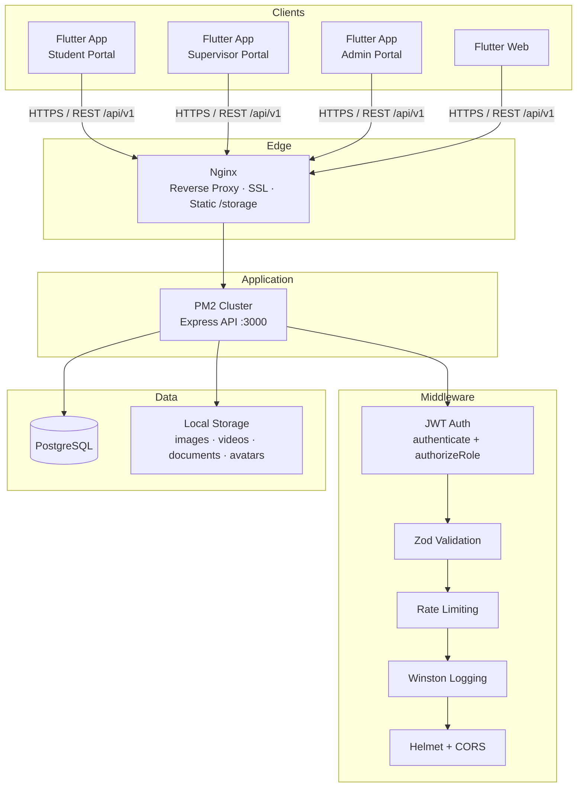
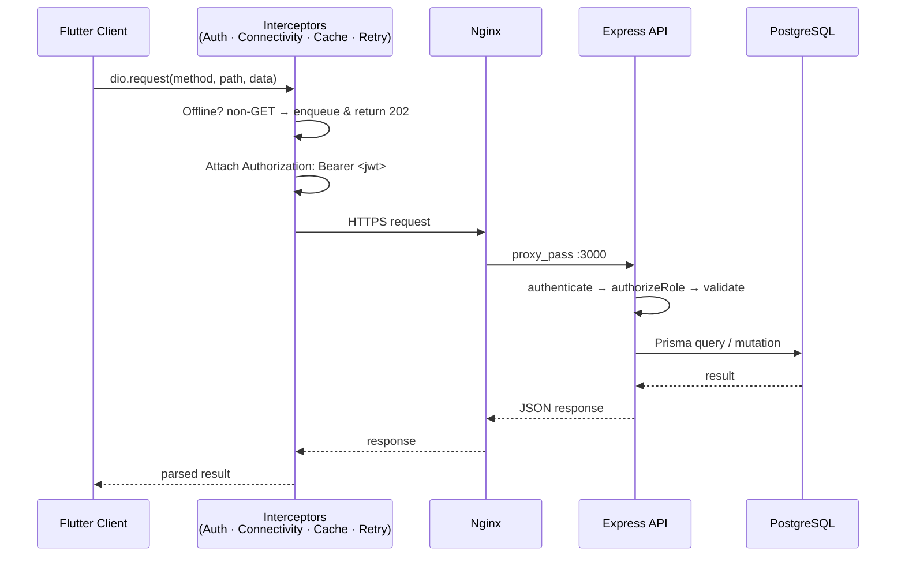
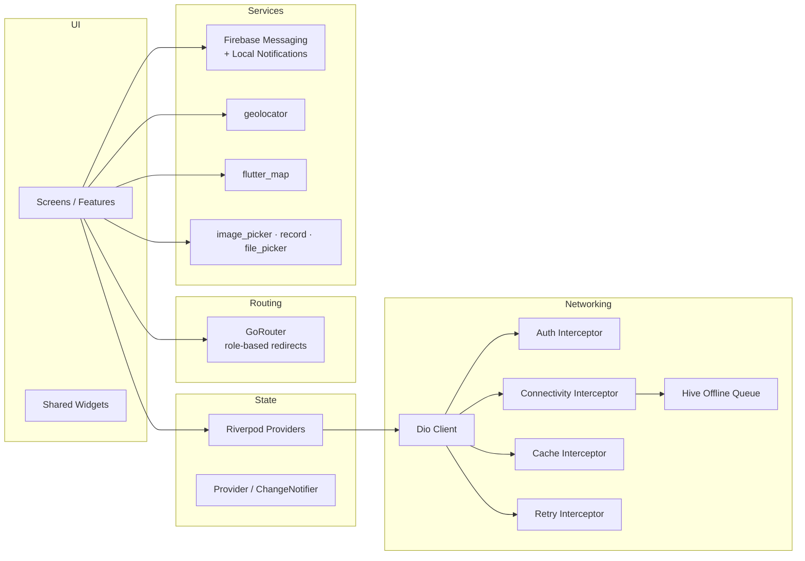
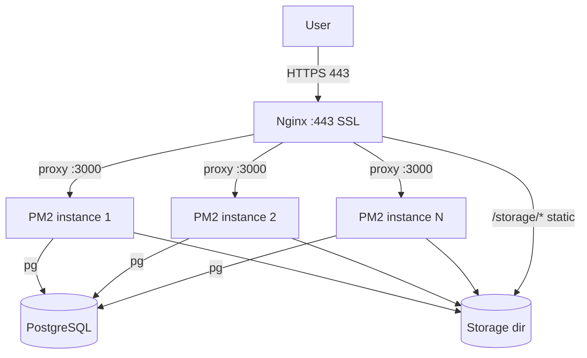

# 02 · System Architecture

> 🧑‍💻 **Audience:** Developers, maintainers, DevOps

---

## 1. High-Level Architecture



---

## 2. Request Flow



---

## 3. Backend Layered Architecture

```
┌──────────────────────────────────────────────────────────────┐
│ Route Layer  (src/**/*.routes.ts)                           │
│   • Define endpoints, wire middlewares & controllers        │
├──────────────────────────────────────────────────────────────┤
│ Middleware Layer (auth.middleware.ts, validation, rate limit)│
│   • authenticate (JWT) • authorizeRole (RBAC) • validate    │
├──────────────────────────────────────────────────────────────┤
│ Controller Layer (src/**/*.controller.ts)                   │
│   • HTTP concerns: req parsing, res status codes, errors    │
├──────────────────────────────────────────────────────────────┤
│ Service Layer (src/**/*.service.ts)                         │
│   • Business logic (sessions, activities, reviews, media)   │
├──────────────────────────────────────────────────────────────┤
│ Data Layer (Prisma ORM + pg adapter)                        │
│   • PostgreSQL via @prisma/adapter-pg (connection pool)     │
└──────────────────────────────────────────────────────────────┘
```

---

## 4. Frontend Architecture (Flutter)



---

## 5. Technology Stack

### Backend
| Layer | Technology |
|-------|-----------|
| Runtime | Node.js + Express 5 (TypeScript, ESM) |
| ORM | Prisma 7 (`@prisma/client`, `@prisma/adapter-pg`) |
| Database | PostgreSQL |
| Validation | Zod |
| Auth | `jsonwebtoken` (JWT) + `bcrypt` |
| Media | `multer`, `sharp`, `fluent-ffmpeg` + `@ffmpeg-installer/ffmpeg` |
| Logging | `winston` + `winston-daily-rotate-file` |
| Security | `helmet`, `cors`, `express-rate-limit` |
| Email | `nodemailer` |
| Ops | PM2 (`ecosystem.config.cjs`), Nginx, Docker/K8s manifests |

### Frontend
| Layer | Technology |
|-------|-----------|
| Framework | Flutter (Android / Web / Desktop) |
| State | `flutter_riverpod`, `provider` |
| Routing | `go_router` |
| Networking | `dio` + `dio_smart_retry` + `dio_cache_interceptor` |
| Offline | `hive` / `hive_flutter` |
| Maps/GPS | `flutter_map`, `latlong2`, `geolocator` |
| Media | `image_picker`, `file_picker`, `record`, `video_player`, `audioplayers` |
| Notifications | `firebase_core`, `firebase_messaging`, `flutter_local_notifications` |
| Secure storage | `flutter_secure_storage` |
| Env | `flutter_dotenv` |
| Charts | `fl_chart`, `shimmer` |

### Deployment Targets
| Target | Notes |
|--------|-------|
| Ubuntu 22.04 / 24.04 | Server OS (Nginx + PM2) |
| Kubernetes | `backend/k8s/` manifests |
| Vercel | Frontend web static hosting (`frontend/vercel.json`) |

---

## 6. Deployment Topology (Production)



- PM2 runs in **cluster mode** (`instances: max`) across all CPUs.
- Nginx serves `/storage/*` directly for maximum media performance.
- Nginx forwards the real client IP (`X-Real-IP` / `X-Forwarded-For`) so rate limiting works correctly.

