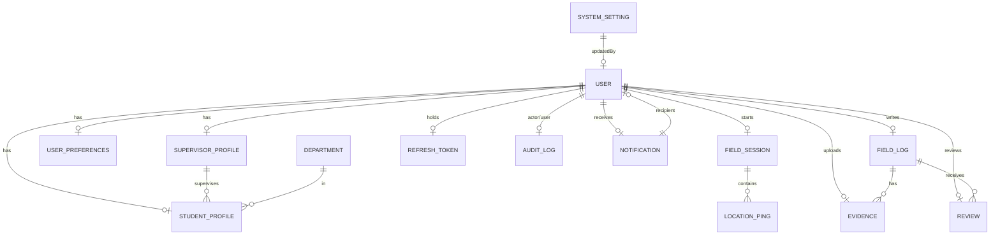
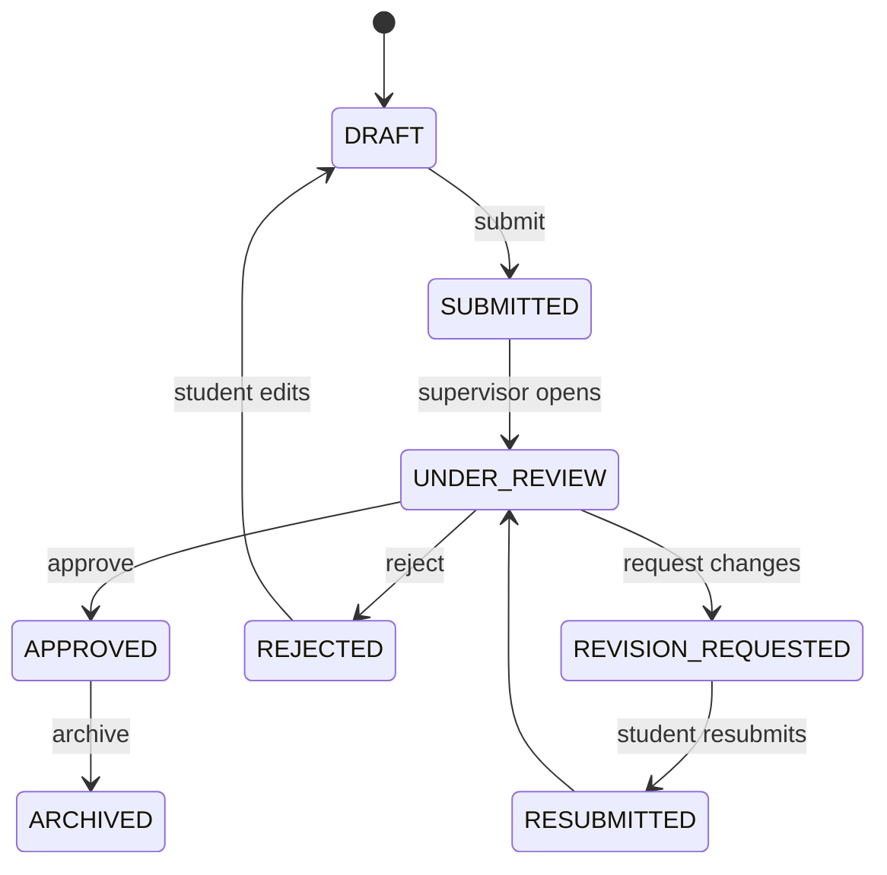

# 03 · Database Design

> 🧑‍💻 **Audience:** Developers, DBAs

Source of truth: [`backend/prisma/schema.prisma`](../backend/prisma/schema.prisma)

---

## 1. ER Diagram



---

## 2. Tables

### User
| Column | Type | Notes |
|--------|------|-------|
| id | `uuid` (PK) | Default `uuid()` |
| role | `Role` | `STUDENT` \| `SUPERVISOR` \| `ADMIN` |
| name | `String` | |
| email | `String` | `@unique` |
| password | `String` | bcrypt-hashed |
| status | `UserStatus` | `ACTIVE`, `PENDING`, `DISABLED`, `SUSPENDED`, `LOCKED`, `ARCHIVED` |
| isActive | `Boolean` | default `true` |
| mustChangePassword | `Boolean` | default `true` |
| resetPasswordOtp | `String?` | 6-digit OTP |
| resetPasswordExpires | `DateTime?` | OTP expiry (10 min) |
| lastLogin | `DateTime?` | |
| failedLoginAttempts | `Int` | default `0` |
| accountLockedUntil | `DateTime?` | 15-min lock after 5 failures |
| twoFactorEnabled | `Boolean` | default `false` |
| loginAlertsEnabled | `Boolean` | default `true` |
| createdAt / updatedAt | `DateTime` | |
| deletedAt | `DateTime?` | soft delete |
| fcmToken | `String?` | Firebase push token |

### StudentProfile
| Column | Type | Notes |
|--------|------|-------|
| id | `uuid` (PK) | |
| userId | `String` | `@unique` → `User` |
| registrationNo | `String` | `@unique` |
| phone / avatar | `String?` | |
| topic | `String?` | Research topic/project |
| status | `Status` | `IDLE` \| `IN_FIELD` \| `CHECKED_OUT` |
| gpsStatus | `String?` | |
| programme / department / faculty | `String?` | |
| supervisorId | `String?` | → `SupervisorProfile` |

### SupervisorProfile
| Column | Type | Notes |
|--------|------|-------|
| id | `uuid` (PK) | |
| userId | `String` | `@unique` → `User` |
| staffNumber | `String` | `@unique` |
| department / faculty / specialization / office / phone / avatar | `String?` | |
| studentCapacity | `Int` | default `20` |

### FieldSession
| Column | Type | Notes |
|--------|------|-------|
| id | `uuid` (PK) | |
| studentId | `String` | → `User` |
| checkInTime | `DateTime` | default `now()` |
| checkOutTime | `DateTime?` | |
| durationSeconds | `Int?` | computed at check-out |
| distanceTravelled | `Float?` | |
| startLatitude / startLongitude | `Float` | |
| endLatitude / endLongitude | `Float?` | |
| startAccuracy / endAccuracy | `Float` / `Float?` | GPS accuracy (metres) |
| averageAccuracy | `Float?` | mean of pings |
| status | `FieldSessionStatus` | `ACTIVE` \| `COMPLETED` |
| batteryLevelStart / batteryLevelEnd | `Int?` | |
| networkType / deviceModel | `String?` | |

### LocationPing
| Column | Type | Notes |
|--------|------|-------|
| id | `uuid` (PK) | |
| sessionId | `String` | → `FieldSession` |
| latitude / longitude | `Float` | |
| accuracy | `Float` | metres |
| altitude / speed / heading | `Float?` | |
| timestamp | `DateTime` | default `now()` |

### FieldLog (Activity)
| Column | Type | Notes |
|--------|------|-------|
| id | `uuid` (PK) | |
| studentId | `String` | → `User` |
| title | `String` | |
| description | `String?` | |
| latitude / longitude / gpsAccuracy | `Float?` | |
| timestamp | `DateTime` | default `now()` |
| status | `ActivityStatus` | `DRAFT` → … → `APPROVED` |
| methodology / objectives / findings / remarks | `String?` | |

### Evidence
| Column | Type | Notes |
|--------|------|-------|
| id | `uuid` (PK) | |
| activityId | `String` | → `FieldLog` |
| uploadedById | `String` | → `User` |
| originalName / storedName | `String` | |
| fileExtension / mimeType | `String` | |
| fileSize | `Int` | bytes |
| width / height / duration | `Int?` | media metadata |
| checksum | `String?` | |
| thumbnailPath | `String?` | |
| storagePath | `String` | relative path under `storage/` |
| uploadStatus | `UploadStatus` | `PENDING` \| `SUCCESS` \| `FAILED` |
| gpsLatitude / gpsLongitude / gpsAccuracy | `Float?` | geo-tag |
| capturedAt / uploadedAt | `DateTime?` | |

### Review
| Column | Type | Notes |
|--------|------|-------|
| id | `uuid` (PK) | |
| activityId | `String` | → `FieldLog` |
| reviewerId | `String` | → `User` |
| rating | `Float` | |
| comments | `String?` | |
| status | `ActivityStatus` | `APPROVED` \| `REJECTED` \| `REVISION_REQUESTED` |
| createdAt | `DateTime` | |

### Notification
| Column | Type | Notes |
|--------|------|-------|
| id | `uuid` (PK) | |
| recipientId | `String` | → `User` |
| senderId | `String?` | → `User` |
| title / message | `String` | |
| type | `NotificationType` | see enums |
| entityType / entityId | `String?` | e.g., `FIELD_SESSION`, `FIELD_LOG` |
| priority | `Int` | `0` normal, `1` high |
| isRead | `Boolean` | default `false` |
| createdAt | `DateTime` | |

### RefreshToken
| Column | Type | Notes |
|--------|------|-------|
| id | `uuid` (PK) | |
| token | `String` | `@unique` |
| deviceInfo / ipAddress | `String?` | |
| userId | `String` | → `User` |
| expiresAt | `DateTime` | 7 days |
| revokedAt | `DateTime?` | rotation/revocation |
| createdAt | `DateTime` | |

### AuditLog
| Column | Type | Notes |
|--------|------|-------|
| id | `uuid` (PK) | |
| actorId | `String?` | who performed the action |
| userId | `String?` | affected user |
| action | `String` | e.g., `LOGIN`, `USER_CREATED`, `PASSWORD_CHANGED` |
| details | `Json?` | extra metadata |
| ipAddress / userAgent / device | `String?` | |
| timestamp | `DateTime` | |

### SystemSetting
| Column | Type | Notes |
|--------|------|-------|
| id | `uuid` (PK) | |
| key | `String` | `@unique` (e.g., `admin_settings`) |
| value | `Json` | |
| updatedAt | `DateTime` | |
| updatedBy | `String?` | |

### UserPreferences
| Column | Type | Notes |
|--------|------|-------|
| id | `uuid` (PK) | |
| userId | `String` | `@unique` → `User` |
| notif* | `Boolean` | 5 notification toggles |
| chanEmail / chanInApp | `Boolean` | channels |
| quietStart / quietEnd | `String` | `"22:00"` / `"06:00"` |
| pref* | `String` | dashboard, landing, zoom, map type, date/time format, language, refresh, rows, theme |
| exportPdf / exportExcel / exportCsv | `Boolean` | |

### Department
| Column | Type | Notes |
|--------|------|-------|
| id | `uuid` (PK) | |
| name | `String` | `@unique` |
| code / faculty / description | `String?` | |
| createdAt / updatedAt | `DateTime` | |

---

## 3. Enums

```prisma
enum Role { STUDENT  SUPERVISOR  ADMIN }
enum UserStatus { ACTIVE  PENDING  DISABLED  SUSPENDED  LOCKED  ARCHIVED }
enum Status { IDLE  IN_FIELD  CHECKED_OUT }              // student field status
enum FieldSessionStatus { ACTIVE  COMPLETED }
enum ActivityStatus {
  DRAFT  SUBMITTED  UNDER_REVIEW  REVISION_REQUESTED
  RESUBMITTED  APPROVED  REJECTED  ARCHIVED
}
enum UploadStatus { PENDING  SUCCESS  FAILED }
enum NotificationType {
  CHECKED_IN  CHECKED_OUT  REVIEW_RECEIVED  REVISION_REQUESTED
  ACTIVITY_APPROVED  SYSTEM_ALERT  NEW_SUBMISSION  SUPERVISOR_MESSAGE
}
```

---

## 4. Activity Lifecycle (status flow)



---

## 5. Indexes & Considerations

- **Unique constraints:** `User.email`, `StudentProfile.registrationNo`, `SupervisorProfile.staffNumber`, `Department.name`, `RefreshToken.token`, `SystemSetting.key`, `UserPreferences.userId`.
- **High-frequency queries** (filtered by `studentId`, `status`, `timestamp`): `FieldLog`, `FieldSession`, `LocationPing`, `Notification`.
- `FieldSession.checkInTime`, `FieldLog.timestamp` are used in period-based dashboard/report queries — consider composite indexes in production.
- Audit logs are append-only and grow quickly — partition or archive per the backup/retention strategy.

---

## 6. Migration Strategy

```bash
cd backend
npx prisma db push   # dev: push schema directly
npx prisma generate  # regenerate client
npx prisma studio    # inspect data
```

For production, promote to `prisma migrate dev/deploy` and store migration files under `prisma/migrations/`.

