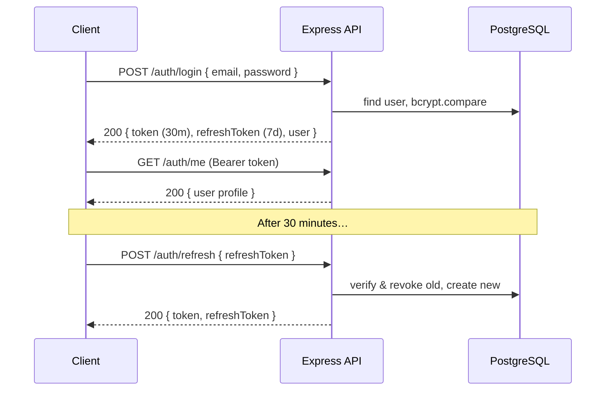
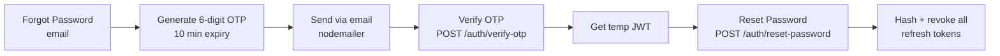

# 05 · Authentication

> 🧑‍💻 **Audience:** Developers, security reviewers

---

## 1. Overview

FieldTrack uses a **JWT access token + rotating refresh token** model with **Role-Based Access Control (RBAC)**.



---

## 2. Access Token (JWT)

- **Signing:** HS256 via `jsonwebtoken` with `JWT_SECRET`.
- **Lifetime:** **30 minutes**.
- **Payload:**
  ```json
  { "userId": "…", "role": "SUPERVISOR", "email": "…", "iat": 1730000000, "exp": 1730001800 }
  ```

### Middleware: `authenticate`
- Reads `Authorization: Bearer <token>`.
- Verifies signature + expiry with `jwt.verify`.
- Attaches `req.user = { userId, role, email }`.
- Returns `401` on missing/invalid token.

### Middleware: `authorizeRole(roles)`
- Checks `req.user.role` is in the allowed list.
- Returns `403` otherwise.

---

## 3. Refresh Token

- **Lifetime:** **7 days**, stored in the `RefreshToken` table.
- **Rotation:** every `/auth/refresh` call revokes the presented token and issues a new one.
- **Revocation:** logout, password change, account suspension/lock, admin reset, deactivate.
- **Validation:** token must exist, not revoked, not expired, cryptographically valid, and the user must be `ACTIVE`.

---

## 4. RBAC Matrix

| Endpoint group | STUDENT | SUPERVISOR | ADMIN |
|----------------|:-------:|:----------:|:-----:|
| `/auth/*` (own session) | ✅ | ✅ | ✅ |
| `/sessions/*` (own) | ✅ | – | – |
| `/activities/*` (own) | ✅ | – | – |
| `/supervisor/students*` | – | ✅ | ✅ |
| `/reviews` (submit) | – | ✅ | – |
| `/reports/supervisor` | – | ✅ | ✅ |
| `/dashboard/admin` | – | – | ✅ |
| `/admin/*` | – | – | ✅ |
| `/notifications` | ✅ | ✅ | ✅ |
| `/settings/*` | ✅ | ✅ | ✅ |

---

## 5. Password Policy & Hashing

- **Hashing:** `bcrypt` with cost **12** (auth + admin controllers) / **10** (settings).
- **Minimum length:** 6 characters (eased policy).
- **Temporary passwords:** admin-created users receive a 12-character random temp password and must change it on first login (`mustChangePassword = true`).
- **Force change flow:** the router redirects users with `mustChangePassword == true` to the force-password-change screen before they can access the portal.

---

## 6. Forgot Password / OTP Flow



- Generic success response prevents **email enumeration**.
- OTP is stored on the `User` record (`resetPasswordOtp`, `resetPasswordExpires`).

---

## 7. Account Lockout & Brute-Force Protection

- **Login rate limit:** 5 failed attempts / 15 min / IP (`express-rate-limit` on `/auth/login`).
- **Failed-attempt tracking:** after **5 consecutive failures**, the account locks for **15 minutes** (`accountLockedUntil`).
- Every failure is recorded in the **audit log** (`FAILED_LOGIN`, `ACCOUNT_LOCKED`).

---

## 8. Session Management

- Users can view/revoke their refresh-token sessions via settings.
- `logout-others` revokes every session except the current one.
- Status changes to `SUSPENDED | LOCKED | DISABLED | ARCHIVED` automatically revoke all refresh tokens.

---

## 9. Client-Side Implementation

- Tokens stored in `flutter_secure_storage` (keys `jwt_token`, `refresh_token`).
- `AuthenticationInterceptor` attaches the token to every request and transparently refreshes on `401`.
- On refresh failure, both tokens are cleared and the user is returned to login.

---

## 10. Security Hardening Summary

| Control | Implementation |
|---------|----------------|
| Transport | HTTPS (Nginx + Let's Encrypt) |
| Security headers | `helmet` |
| CORS | `cors()` (open in dev; restrict in prod) |
| Rate limiting | Global 100/15min + login 5/15min |
| Input validation | `zod` schemas (`auth.schema.ts`) |
| Password hashing | bcrypt (10–12 rounds) |
| Token storage | secure storage (device) |
| Audit trail | `AuditLogService` on auth events |

