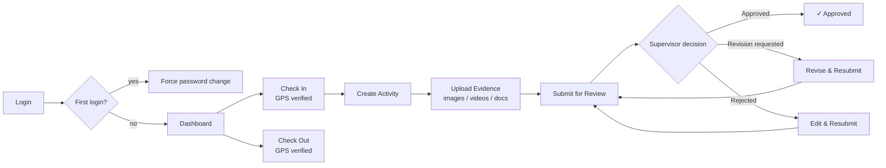

# 06 · Student Portal

> 🧑‍💻 **Audience:** Developers; also summarizes the student user journey

---

## 1. Overview

The Student Portal is the primary field-facing interface. Students use it to:

- Check in / check out of a GPS-verified field session
- Log structured field activities with methodology, objectives, findings & remarks
- Attach geo-tagged evidence (images, videos, documents)
- Track feedback from their supervisor
- Manage profile, preferences, and notifications

Screens live under `frontend/lib/features/` (`auth`, `dashboard`, `field_session`, `activities`, `map`, `checkin`, `notifications`, `profile`, `settings`).

---

## 2. Student Workflow

---

## 3. Screens & Flows

### 3.1 Authentication (`features/auth/`)
| Screen | Route | Purpose |
|--------|-------|---------|
| Splash | `/splash` | Branding, session restore |
| Welcome | `/welcome` | Choose login path |
| Login | `/login` | Email or registration number + password |
| Forgot Password | `/forgot-password` | Request OTP |
| OTP Verification | `/otp` | Verify 6-digit OTP |
| Reset Password | `/reset-password` | Set new password |
| Force Password Change | `/force-password-change` | First-login mandatory change |

### 3.2 Dashboard (`features/dashboard/`)
- Summary cards: status, hours logged, approvals, recent logs.
- Quick actions: check-in, new activity, view map.

### 3.3 Check-In / Field Session (`features/checkin/`, `features/field_session/`)
- **Check-in** sends `studentId`, `latitude`, `longitude`, `accuracy` to `POST /sessions/checkin`.
- Requires an acquired GPS fix (the UI blocks check-in while `location.isLocating` or lat/lng is `0.0`).
- The active session screen shows elapsed time and allows check-out with end GPS.

### 3.4 Activities (`features/activities/`)
| Screen | Purpose |
|--------|---------|
| Activities list | All field logs with status badges |
| Create/Edit | Draft fields: title, description, methodology, objectives, findings, remarks, location |
| Detail | Full log + evidence + review feedback |

Lifecycle: `DRAFT → SUBMITTED → UNDER_REVIEW → (APPROVED | REVISION_REQUESTED | REJECTED) → RESUBMITTED…`

### 3.5 Evidence Upload
- Images: `image_picker` (gallery/camera)
- Videos: `record` + `video_player`
- Documents: `file_picker`
- Uploaded via `POST /media/upload` (multipart) with GPS metadata.

### 3.6 Map (`features/map/`)
- Student's current position and session history using `flutter_map`.

### 3.7 Notifications (`features/notifications/`)
- In-app notification list (read/unread), marked read via `PATCH /notifications/:id/read`.

### 3.8 Profile & Settings (`features/profile/`, `features/settings/`)
- Profile info, avatar upload, preferences (notifications, theme, date/time format, map defaults), security settings, sessions.

---

## 4. Student API Usage (from `ApiEndpoints`)

| Action | Endpoint |
|--------|----------|
| Login | `POST /auth/login` |
| Check-in | `POST /sessions/checkin` |
| Check-out | `PATCH /sessions/checkout` |
| Active session | `GET /sessions/active?studentId=` |
| Location ping | `POST /sessions/ping` |
| List activities | `GET /activities/student/all?studentId=` |
| Create activity | `POST /activities` |
| Submit activity | `POST /activities/:id/submit` |
| Upload media | `POST /media/upload` |
| Notifications | `GET /notifications` |
| Profile | `GET /auth/me`, `GET /settings/profile` |

---

## 5. Design Notes

- **Offline-first:** field actions (create activity, submit, upload, check-in) are queued in Hive when offline and replayed on reconnect.
- **GPS gating:** the check-in button is disabled until a valid GPS fix is available.
- **Feedback loop:** review outcomes surface immediately on the activity detail screen.

