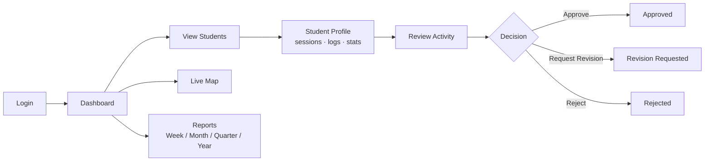

# 07 · Supervisor Portal

> 🧑‍💻 **Audience:** Developers; also summarizes the supervisor user journey

---

## 1. Overview

The Supervisor Portal gives academic supervisors real-time visibility and control over their assigned students' field activities.

Key capabilities:

- **Dashboard** — live stats (students in field, checked in/out, pending approvals) and activity trends
- **Students** — list of assigned students with live status and last activity
- **Student profile** — field sessions, activities, evidence, statistics, timeline
- **Field logs** — daily field logs for a student
- **Live map** — student locations on an interactive map
- **Review** — approve / reject / request revision with rating & comments
- **Reports** — period-based activity reports (week / month / quarter / year)

Screens live under `frontend/lib/features/supervisor/`. Dedicated entry point: `lib/main_supervisor.dart`.

---

## 2. Supervisor Workflow



---

## 3. Screens & Flows

### 3.1 Authentication (`features/supervisor/authentication/`)
- `supervisor_login_screen.dart`, `supervisor_forgot_password_screen.dart`, `supervisor_otp_screen.dart`, `supervisor_reset_password_screen.dart`.
- Router: `supervisor_router.dart` (guards all `/supervisor/*` routes by role).

### 3.2 Dashboard (`features/supervisor/dashboard/`)
- `supervisor_dashboard_screen.dart` + `DashboardState` (ChangeNotifier) + `supervisor_dashboard_provider.dart`.
- Data: `GET /dashboard/supervisor`.
- Shows: students in field, checked in/out, pending approvals, activities submitted, trends, recent activities, active field sessions.

### 3.3 Students (`features/supervisor/students/`)
- `supervisor_students_screen.dart` — list of assigned students with live status via `GET /supervisor/students`.
- `student_repository.dart` — repository layer for student data.

### 3.4 Student Profile (`features/supervisor/student_profile/`)
- `supervisor_student_profile_screen.dart` — full profile via `GET /supervisor/students/:id`.
- Displays statistics (total field days, activities, evidence, distance travelled, avg GPS accuracy), timeline, recent sessions, and activities.

### 3.5 Field Logs (`features/supervisor/field_logs/`)
- `supervisor_daily_field_logs_screen.dart` — daily logs for a student with evidence preview.

### 3.6 Review (`features/supervisor/review/`)
- `supervisor_review_screen.dart` — opens an activity, shows evidence, and submits a decision via `POST /reviews`:
  ```json
  { "activityId": "…", "reviewerId": "…", "rating": 4, "comments": "…", "status": "APPROVED" }
  ```
- Allowed statuses: `APPROVED`, `REJECTED`, `REVISION_REQUESTED`.

### 3.7 Evidence (`features/supervisor/evidence/`)
- `supervisor_evidence_screen.dart` — inspect uploaded evidence for an activity.

### 3.8 Location & Map (`features/supervisor/location/`, `features/supervisor/map/`)
- `supervisor_location_screen.dart` — a student's GPS ping history (`GET /sessions/student/:studentId/pings`).
- `supervisor_map_screen.dart` — live positions of assigned students.

### 3.9 Reports (`features/supervisor/reports/`)
- `supervisor_reports_screen.dart` + `supervisor_reports_provider.dart`.
- Calls `GET /reports/supervisor?period=…` with filters: **This Week**, **This Month**, **This Quarter**, **This Year**.
- Renders stats cards, methodology gauge, trend chart (`fl_chart`), recent activities feed, and log summary with export/print support.

### 3.10 Settings & Profile
- `supervisor_settings_screen.dart` (tabs: Notifications, Security, Preferences, Help)
- `supervisor_profile_screen.dart`

---

## 4. Supervisor API Usage

| Action | Endpoint |
|--------|----------|
| Login | `POST /auth/login` |
| Dashboard stats | `GET /dashboard/supervisor` |
| Dashboard quick stats | `GET /supervisor/dashboard/stats` |
| Students list | `GET /supervisor/students` |
| Student profile | `GET /supervisor/students/:id` |
| Student pings | `GET /sessions/student/:studentId/pings` |
| Review activity | `POST /reviews` |
| Reports | `GET /reports/supervisor?period=This+Month` |

---

## 5. Design Notes

- **Role guard:** supervisor routes require `SUPERVISOR` or `ADMIN`; otherwise the router logs out and redirects.
- **Fresh supervisors** see empty stats until students are assigned (no fallback demo data).
- **Reports** are server-computed period aggregates; trends adapt intervals to the selected period (daily for week, weekly for month, monthly for quarter/year).

