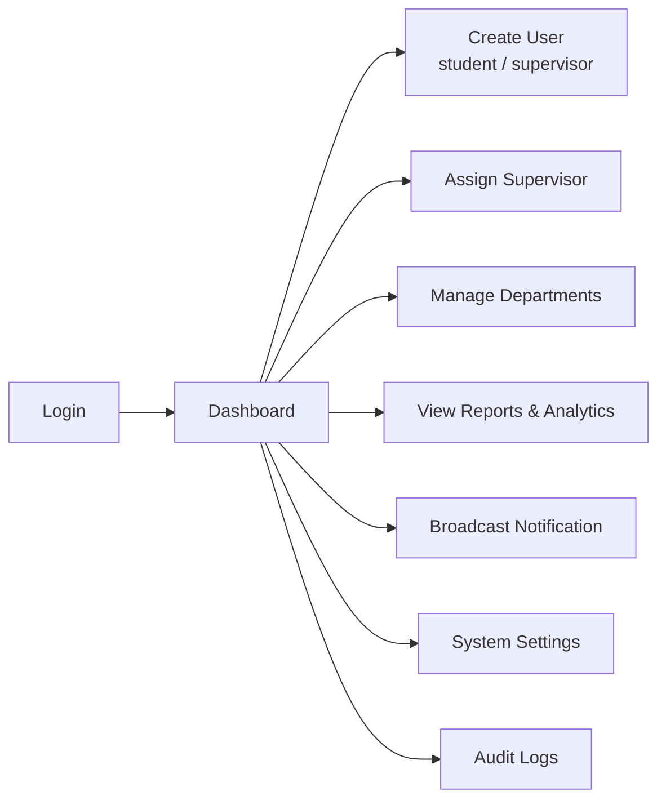

# 08 · Admin Portal

> 🧑‍💻 **Audience:** Developers; also summarizes the administrator user journey

---

## 1. Overview

The Admin Portal is the system administration interface. It gives administrators full control over the FieldTrack deployment.

Key capabilities:

- **Dashboard** — institution-wide analytics (students, supervisors, in-field counts, submissions, trends, department stats, system activity)
- **User management** — create students/supervisors, edit, change status, reset passwords, reassign supervisors, archive
- **Departments** — create and manage departments, view students/supervisors/projects per department
- **Projects** — view research projects and progress
- **Map** — live map of all active field sessions
- **Notifications** — broadcast announcements
- **Audit** — full audit-trail review
- **Settings** — system configuration (university name, GPS radius, SMTP, backup, security thresholds, etc.)

Screens live under `frontend/lib/features/admin/`. Dedicated entry point: `lib/main_admin.dart`.

---

## 2. Admin Workflow

---

## 3. Screens & Flows

### 3.1 Authentication (`features/admin/auth/`)
- `admin_login_screen.dart`, `admin_forgot_password_screen.dart`, `admin_otp_screen.dart`, `admin_reset_password_screen.dart`.

### 3.2 Dashboard (`features/admin/dashboard/`)
- `admin_dashboard_screen.dart` + `admin_dashboard_provider.dart`.
- Data: `GET /dashboard/admin?period=…`.
- Shows: total students, active supervisors, students in field, submissions, pending reviews, active projects, activity & attendance trends, submission status breakdown, department stats, recent users, system activities (from audit logs).

### 3.3 User Management (`features/admin/users/`)
| Screen | Purpose |
|--------|---------|
| `admin_users_screen.dart` | List/search users, role filters |
| `add_user_screen.dart` | Create student or supervisor (returns temp password) |
| `edit_user_screen.dart` | Edit profile fields |
| `user_profile_screen.dart` | Full profile + actions (reset password, status, reassign, archive) |
| `add_user_dialog.dart` | Inline creation dialog |

### 3.4 Departments (`features/admin/departments/`)
| Screen | Purpose |
|--------|---------|
| `admin_departments_screen.dart` | Department list with student/supervisor/project counts |
| `admin_add_department_screen.dart` | Create department |
| `admin_department_detail_screen.dart` | Department drill-down |

### 3.5 Projects (`features/admin/projects/`)
- `admin_projects_screen.dart` — research projects with topic, supervisor, student, progress.

### 3.6 Map (`features/admin/map/`)
- `admin_map_screen.dart` — live markers of all active field sessions (`GET /admin/map`).

### 3.7 Notifications (`features/admin/notifications/`)
- `admin_notifications_screen.dart` — recent system notifications + broadcast composer (`POST /admin/notifications/broadcast`).

### 3.8 Audit (`features/admin/audit/`)
- `admin_audit_screen.dart` — paginated audit log (`GET /admin/audit-logs`).

### 3.9 Reports (`features/admin/reports/`)
- `admin_reports_screen.dart` — institution reports.

### 3.10 Settings (`features/admin/settings/`)
- `admin_settings_screen.dart` — university info, session timeout, GPS deviation radius, sync interval, SMTP, backup schedule, password policy, SSO/2FA toggles, S3 bucket URI, Slack webhook.

---

## 4. Admin API Usage

| Action | Endpoint |
|--------|----------|
| Login | `POST /auth/login` |
| Dashboard | `GET /dashboard/admin?period=` |
| Create student | `POST /admin/users/students` |
| Create supervisor | `POST /admin/users/supervisors` |
| List users | `GET /admin/users` |
| User detail | `GET /admin/users/:id` |
| Update user | `PUT /admin/users/:id` |
| Status change | `PATCH /admin/users/:id/status` |
| Reassign supervisor | `PATCH /admin/users/:id/supervisor` |
| Reset password | `POST /admin/users/:id/reset-password` |
| Delete (archive) | `DELETE /admin/users/:id` |
| Departments | `GET/POST /admin/departments` |
| Department details | `GET /admin/departments/:id` |
| Global search | `GET /admin/search?q=` |
| Projects | `GET /admin/projects` |
| Audit logs | `GET /admin/audit-logs` |
| Broadcast | `POST /admin/notifications/broadcast` |
| Settings | `GET/PUT /admin/settings` |
| Live map | `GET /admin/map` |

---

## 5. Design Notes

- **Security:** all `/admin/*` endpoints require `ADMIN` role (`router.use(authenticate, authorizeRole(['ADMIN']))`).
- **Account hygiene:** the first admin is auto-created from `ADMIN_EMAIL` / `ADMIN_PASSWORD` env vars on boot (`admin-sync.ts`); the seed script also provisions one.
- **Auditability:** sensitive admin actions are logged via `AuditLogService` with actor, affected user, IP, and user-agent.

