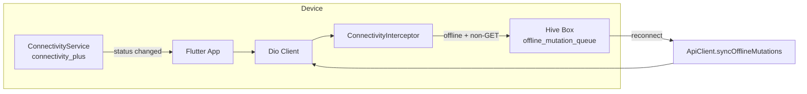

# 10 · Offline Synchronization

> 🧑‍💻 **Audience:** Developers, QA

FieldTrack is **offline-first**: students working in remote field sites with intermittent connectivity can still record activities, check in/out, and upload evidence, with all mutations queued and replayed automatically when connectivity returns.

---

## 1. Architecture

---

## 2. Components

### 2.1 Connectivity Detection — `connectivity_service.dart`
- Wraps `connectivity_plus`.
- Broadcasts `ConnectionStatus { online, offline, poor, reconnecting }`.
- On status change to `online`, triggers synchronization.

### 2.2 Connectivity Interceptor — `connectivity_interceptor.dart`
- Runs **before** every request.
- If offline **and** the method is not `GET`:
  1. Serializes the request (`method`, `path`, `headers`, `data`, `timestamp`).
  2. Enqueues it into the Hive box `offline_mutation_queue`.
  3. Shows a toast: *"No internet connection. Action queued for synchronization."*
  4. Resolves the request locally with **HTTP 202** `{ "queued": true }` so the UI can continue.
- `GET` requests fall through to the cache interceptor (stale-while-revalidate).

### 2.3 Offline Queue Service — `offline_queue_service.dart`
- Hive-backed queue (`hive_flutter`).
- `enqueueRequest(RequestOptions)` — stores JSON-encoded request.
- `syncQueue(Dio)` — replays each queued request:
  - On success → deletes from queue.
  - On **HTTP 409** (conflict) → deletes from queue (conflict accepted; avoids infinite retry loop).
  - On other errors (still offline) → leaves in queue for next sync.

### 2.4 Reconnect Trigger — `api_client.dart`
- Subscribes to `ConnectivityService().onStatusChange`.
- On `online`, calls `syncOfflineMutations()` then shows a success toast.

---

## 3. Sync & Conflict Strategy

| Scenario | Behavior |
|----------|----------|
| Device offline, user creates activity | Queued with 202; UI shows "queued" |
| Device offline, user submits activity | Queued; replayed on reconnect |
| Device offline, upload evidence | Queued; replayed with same multipart payload |
| Reconnect while queue non-empty | Replay in FIFO order |
| Server returns 409 on replay | Conflict accepted → item dropped from queue |
| Server returns 5xx / network error | Item retained; retried on next sync event |
| GET while offline | Served from Hive cache (max-stale 7 days) |

> **Note:** The current implementation does not perform field-level three-way merges. It relies on the server's idempotent status transitions and conflict signalling. A richer last-write-wins / versioning strategy is listed in [Future Improvements](./20_Future_Improvements.md).

---

## 4. Caching Layer

`dio_cache_interceptor` + `dio_cache_interceptor_hive_store`:

- Policy: `CachePolicy.request` (cache check first, network refresh in background).
- `maxStale`: **7 days**.
- `hitCacheOnErrorExcept`: `[401, 403, 404, 500]`.
- Cache key builder appends the auth-token hash so per-user data is not leaked across sessions.
- `allowPostMethod: false` — mutations never cached.

---

## 5. Retry Strategy

`dio_smart_retry` (`RetryInterceptor`):

- Retries: **3**.
- Delays: 1s → 2s → 3s.
- Retry only for: connection timeout, receive timeout, send timeout, `SocketException`.

---

## 6. Known Limitations & Future Work

- Offline queue is per-device (no cross-device merge yet).
- Media uploads queue the multipart payload as JSON — large payloads are stored in Hive; consider a dedicated file spool for very large videos.
- No conflict-resolution UI yet (409 silently drops the queued item).
- Future: background sync worker, field-level merge, revision-based versioning, and a conflict resolution screen.

