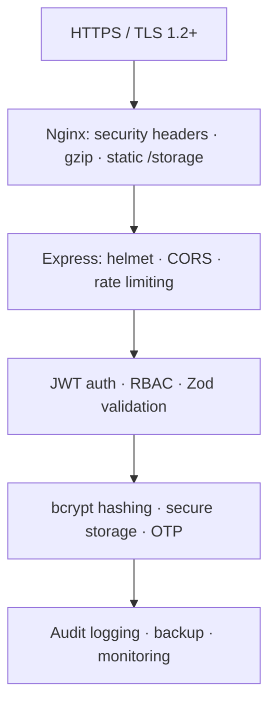

# 11 · Security

> 🧑‍💻 **Audience:** Developers, security reviewers, DevOps

---

## 1. Security Posture

FieldTrack follows defense-in-depth: **transport security → edge hardening → API security → application security → data security → auditability**.

---

## 2. Authentication Security

- **JWT access tokens:** HS256, 30-minute lifetime, signed with `JWT_SECRET`.
- **Refresh tokens:** 7-day lifetime, stored in DB, **rotated on every refresh**, revoked on logout/password change/status change.
- **Password hashing:** bcrypt with cost 10–12.
- **Account lockout:** 5 failed attempts → 15-minute lock (`accountLockedUntil`).
- **Login rate limit:** 5 attempts / 15 min / IP.
- **Forgot password:** OTP (6 digits, 10-min expiry) sent via email; generic responses prevent email enumeration.

---

## 3. Authorization (RBAC)

| Role | Scope |
|------|-------|
| `STUDENT` | Own sessions, activities, evidence, notifications, settings |
| `SUPERVISOR` | Assigned students, reviews, reports, dashboards |
| `ADMIN` | Everything (user management, settings, audit, broadcast) |

Enforced via `authenticate` (JWT) + `authorizeRole([...])` middleware on every protected route. The frontend routers independently redirect non-permitted roles.

---

## 4. API Security Controls

| Control | Implementation |
|---------|----------------|
| Security headers | `helmet()` (CSP, HSTS, X-Frame-Options, nosniff…) |
| CORS | `cors()` — restrict origin in production |
| Global rate limit | 100 req / 15 min / IP on `/api` |
| Login rate limit | 5 req / 15 min / IP |
| Input validation | Zod schemas on auth payloads; controller-level checks elsewhere |
| Body size | `express.json()` defaults (mitigate oversized payloads) |
| File upload | Multer: 50 MB cap + MIME allowlist |
| Trust proxy | `app.set('trust proxy', 1)` with Nginx forwarding `X-Forwarded-For` |

---

## 5. Media / Upload Security

- **MIME allowlist:** `image/jpeg|png|webp`, `video/mp4|webm`, `application/pdf`, `application/msword`, `…wordprocessingml.document`.
- **Size cap:** 50 MB.
- **Processing:** images re-encoded via `sharp` (strips EXIF/metadata), videos thumbnailed via FFmpeg.
- **Storage:** served from `/storage` with `Cache-Control: immutable`; static path outside the app router.
- **Tip:** for production, consider an antivirus scan step and serving uploads from a separate domain/bucket.

---

## 6. Data Security

- **At rest:** PostgreSQL credentials via `DATABASE_URL`; passwords bcrypt-hashed; backups gzipped + SHA-256 checksummed.
- **In transit:** HTTPS only in production (Nginx TLS 1.2/1.3).
- **Client storage:** JWT + refresh tokens in `flutter_secure_storage` (Keystore/Keychain).
- **Offline cache:** Hive store (device-local); cache keys include auth hash to prevent cross-user leaks.

---

## 7. Auditability

`AuditLogService` records every sensitive event:

| Event | Example actions |
|-------|-----------------|
| Authentication | `LOGIN`, `LOGOUT`, `FAILED_LOGIN`, `ACCOUNT_LOCKED`, `PASSWORD_CHANGED`, `PASSWORD_RESET` |
| Admin | `USER_CREATED`, `USER_UPDATED`, `USER_STATUS_UPDATED`, `USER_ARCHIVED`, `SUPERVISOR_REASSIGNED`, `BROADCAST_SENT`, `SETTINGS_UPDATED`, `MANUAL_BACKUP` |

Each entry captures: actor, affected user, action, JSON details, IP address, user agent, device, timestamp. The admin audit screen (`docs/08_Admin_Portal.md`) exposes paginated audit logs.

---

## 8. Infrastructure Security

| Layer | Control |
|-------|---------|
| Network | Firewall: only 22/80/443 open; DB not exposed |
| Reverse proxy | Nginx hardened TLS, HSTS, security headers |
| Process | PM2 cluster as non-root user (`fieldtrack`) |
| OS | `fail2ban`, unattended-upgrades, regular patching |
| Backups | Daily encrypted/checksummed backups; off-site copy planned |

---

## 9. Security Checklist

- [ ] `JWT_SECRET` is a long random string, never committed.
- [ ] `NODE_ENV=production` and `helmet()` active.
- [ ] Nginx forwards real IPs; rate limiting verified behind proxy.
- [ ] SMTP creds stored in env, not code.
- [ ] PostgreSQL bound to localhost.
- [ ] File-upload MIME + size limits enforced.
- [ ] Refresh tokens revoked on logout/password change.
- [ ] Audit log enabled and monitored.

