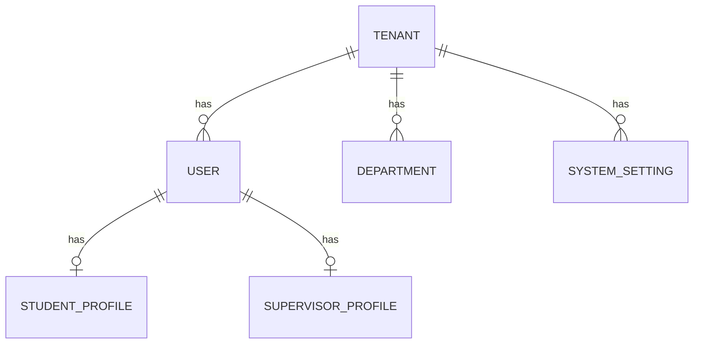

# 13 · Multi-Tenant Architecture (Future)

> 🧑‍💻 **Audience:** Architects, product owners

---

## 1. Context

FieldTrack v1 is a **single-tenant** deployment for one university. The current schema already models the essentials (users, roles, departments, profiles) without a hard coupling to a single institution. A future **multi-university (multi-tenant)** deployment would allow one platform instance to serve many universities with complete data isolation.

---

## 2. Requirements

| Requirement | Description |
|-------------|-------------|
| Tenant isolation | Data of one university must never be visible to another |
| Shared codebase | One backend + one app, no per-university forks |
| Branding | Per-tenant theming (logo, colors, name) |
| Admin per tenant | Each university has its own administrators |
| Billing/limits (optional) | Per-tenant user caps, storage quotas |

---

## 3. Proposed Data Model



Add a `Tenant` model:

```prisma
model Tenant {
  id            String   @id @default(uuid())
  name          String   @unique
  code          String   @unique
  domain        String?  @unique        // e.g. univ-a.ac.ke
  theme         Json?                   // branding: colors, logo
  settings      Json?                   // tenant-specific config
  createdAt     DateTime @default(now())
  updatedAt     DateTime @updatedAt
  users         User[]
  departments   Department[]
}
```

And attach `tenantId` to:
- `User`
- `Department`
- `SystemSetting`
- `UserPreferences`

**Enforcement:** a global middleware reads the tenant from the JWT claim (`tenantId`) or subdomain, then **scopes every Prisma query** with `where: { tenantId }` (and adds `tenantId` to all creates).

---

## 4. Tenancy Strategies (Comparison)

| Strategy | Pros | Cons | Recommendation |
|----------|------|------|----------------|
| **Shared DB, shared schema + `tenantId` row** | Simple, cheap, easy migrations | Risk of cross-tenant leaks if a query is unscoped | ✅ Start here |
| Shared DB, schema-per-tenant | Better isolation, easier per-tenant index | Migration fan-out, connection overhead | Advanced |
| DB-per-tenant | Strongest isolation | Costly, hard to manage many DBs | For enterprise tier |

---

## 5. Authentication & Routing Changes

### JWT
Add `tenantId` to the token payload and to `TokenPayload`.

### Login
```
POST /auth/login
Body: { "email": "…", "password": "…", "tenantCode": "pwani" }
```
Resolve `tenantId` from `tenantCode`, verify the user belongs to it, issue a token carrying `tenantId`.

### Domain-based routing (optional)
- `pwani.fieldtrack.app` → Pwani University tenant
- `ku.fieldtrack.app` → another university tenant
- Nginx maps subdomains to headers (`X-Tenant-Code`), backend resolves the tenant.

---

## 6. Frontend Changes

- `ApiClient` sends `X-Tenant-Code` header (from login/domain).
- `AuthUser` carries `tenantId`.
- Theming: load tenant branding from `GET /tenant/theme`.
- Login screen gains a "university / tenant code" field (or is pre-filled from the subdomain).

---

## 7. Migration Path from v1

1. Add `Tenant` model + `tenantId` columns (nullable initially).
2. Create a default tenant for the existing university; backfill `tenantId` on all rows.
3. Make `tenantId` required; add composite indexes.
4. Introduce tenant-scoping middleware; run integration tests for isolation.
5. Enable subdomain routing and per-tenant branding.
6. Optionally add per-tenant storage quotas and usage dashboards.

---

## 8. Risks & Mitigations

| Risk | Mitigation |
|------|-----------|
| Cross-tenant data leak | Centralized query guard + integration tests asserting isolation |
| Query performance | Composite indexes on `(tenantId, ...)` for hot tables |
| Migration complexity | Backfill script + staged rollout (nullable → required) |
| Per-tenant config sprawl | Use `Json` settings field with validated defaults |

See [20_Future_Improvements.md](./20_Future_Improvements.md) for the roadmap.

