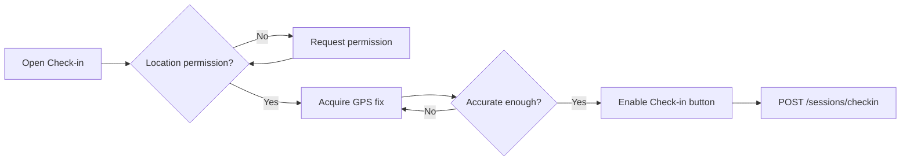
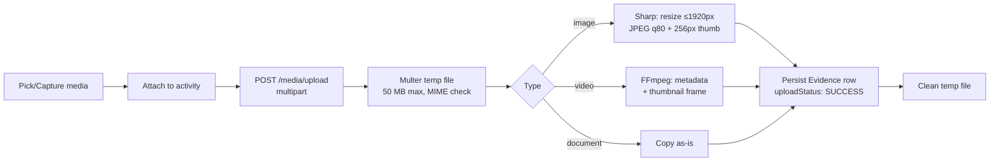

# 17 · GPS & Media Workflow

> 🧑‍💻 **Audience:** Developers, QA, field coordinators

---

## Part A — GPS Workflow

### 1. Location Permissions
- The Flutter app uses `geolocator` and requests location permission at runtime (Android manifest includes coarse/fine location).
- The app does not proceed to check-in until the user grants location access.

### 2. Acquiring a Fix
- `locationProvider` listens to `geolocator.getCurrentPosition()` / position stream.
- The **check-in button is gated** on:
  - `location.isLocating == false`
  - `latitude != 0.0` and `longitude != 0.0`
  - Accuracy within a usable range (device-dependent)



### 3. Check-in Validation
- **Request:** `studentId`, `latitude`, `longitude`, `accuracy` (all required — server returns `400` if missing).
- **Duplicate guard:** `SessionService.checkIn` rejects if an `ACTIVE` session already exists today (HTTP `409`).

### 4. Session & Ping Tracking
- While active, the app can send periodic **location pings** (`POST /sessions/ping`) with `sessionId`, coords, accuracy, altitude, speed, heading.
- On **check-out**, the server computes:
  - `durationSeconds` = check-out − check-in
  - `averageAccuracy` = mean of ping + boundary accuracies
  - `distanceTravelled` (currently stubbed; Haversine can be added)
  - end coordinates + battery level

### 5. Distance Calculation
- The schema stores `distanceTravelled` on `FieldSession`.
- Current implementation leaves distance as `0` (Haversine marked as future work).
- Recommendation: use Haversine over sorted `LocationPing`s.

### 6. Map Visualization
- **Student map:** current position + session history (`features/map/`).
- **Supervisor map:** live positions of assigned students (`features/supervisor/map/`).
- **Admin map:** all active field sessions institution-wide (`GET /admin/map` returns markers with student name, dept, avatar, check-in time, accuracy).

### 7. GPS Accuracy Handling
| Accuracy | Interpretation |
|----------|----------------|
| 0–10 m | Excellent (open sky) |
| 10–30 m | Good |
| 30–100 m | Fair — still usable, logged |
| > 100 m | Poor — warn user before check-in |

- `gpsAccuracy`/`gpsDeviationRadius` (system setting) can be used to flag out-of-bound checks in future versions.

---

## Part B — Media Workflow

### 1. Capture Options
| Type | Source | Flutter package |
|------|--------|-----------------|
| Image | Camera / gallery | `image_picker` |
| Video | Camera / gallery | `record`, `video_player` |
| Audio | Microphone | `record`, `audioplayers` |
| Document | File manager | `file_picker` |

### 2. Upload Pipeline



### 3. Validation & Constraints
- **Max size:** 50 MB per file (multer `limits.fileSize`).
- **Allowed MIME types:** `image/jpeg`, `image/png`, `image/webp`, `video/mp4`, `video/webm`, `application/pdf`, `application/msword`, `application/vnd.openxmlformats-officedocument.wordprocessingml.document`.
- **Required fields:** `activityId`, `uploaderId`.
- **Optional geo-tag:** `gpsLatitude`, `gpsLongitude`, `gpsAccuracy`, `capturedAt`.

### 4. Storage Layout
```
storage/
├── images/YYYY/MM/          # <uuid>.jpg + thumb_<uuid>.jpg
├── videos/YYYY/MM/          # <uuid>.mp4 + thumb_<uuid>.jpg
└── documents/YYYY/MM/       # <uuid>.pdf|docx
```
- Served statically at `/storage/...` with 30-day immutable cache and byte-range support for streaming.

### 5. Evidence Record Fields
`originalName`, `storedName`, `fileExtension`, `mimeType`, `fileSize`, `width`, `height`, `duration`, `thumbnailPath`, `storagePath`, `uploadStatus`, GPS metadata, `capturedAt`, `uploadedAt`.

### 6. Evidence Validation
- `Evidence` links to a `FieldLog` via `activityId`.
- `uploadStatus` transitions `PENDING → SUCCESS` (or `FAILED` on error).
- Thumbnails enable fast list previews in supervisor evidence screens.
- Offline uploads are queued by the connectivity interceptor and replayed on reconnect.

### 7. Avatars
- Upload via `POST /settings/avatar` (multipart).
- Processed with Sharp → **400×400 WebP q80**.
- Stored in `storage/avatars/` and served at `/storage/avatars/...`.

