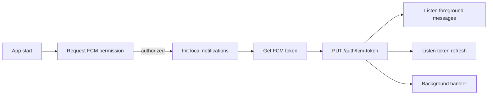

# 18 · Notification System

> 🧑‍💻 **Audience:** Developers, QA

---

## 1. Overview

FieldTrack has a two-track notification system:

1. **In-app notifications** — persisted in PostgreSQL (`Notification` table), shown in the app's notification lists.
2. **Push notifications (FCM)** — Firebase Cloud Messaging + local notifications for high-importance alerts (future: fully wired per-trigger).

---

## 2. Notification Types

```prisma
enum NotificationType {
  CHECKED_IN
  CHECKED_OUT
  REVIEW_RECEIVED
  REVISION_REQUESTED
  ACTIVITY_APPROVED
  SYSTEM_ALERT
  NEW_SUBMISSION
  SUPERVISOR_MESSAGE
}
```

| Type | Example trigger | Typical recipient |
|------|-----------------|-------------------|
| `CHECKED_IN` | Student checks in | Supervisor |
| `CHECKED_OUT` | Student checks out | Supervisor |
| `NEW_SUBMISSION` | Student submits activity | Supervisor |
| `REVIEW_RECEIVED` | Supervisor reviews | Student |
| `REVISION_REQUESTED` | Supervisor requests changes | Student |
| `ACTIVITY_APPROVED` | Activity approved | Student |
| `SYSTEM_ALERT` | Admin broadcast / system event | Everyone |
| `SUPERVISOR_MESSAGE` | Supervisor message | Student |

---

## 3. Storage Model

`Notification` record fields:

| Field | Purpose |
|-------|---------|
| `recipientId` | Who receives it |
| `senderId` | Who sent it (nullable = system) |
| `title` / `message` | Display text |
| `type` | `NotificationType` |
| `entityType` / `entityId` | Link to `FIELD_SESSION`, `FIELD_LOG`, etc. |
| `priority` | `0` normal, `1` high |
| `isRead` | Read status (default `false`) |
| `createdAt` | Timestamp |

---

## 4. In-App API

| Method | Path | Description |
|--------|------|-------------|
| GET | `/notifications` | Latest 50 notifications for the authenticated user |
| PATCH | `/notifications/:id/read` | Mark one notification as read |

The admin broadcast endpoint creates notifications for **all active students & supervisors**:

```json
POST /admin/notifications/broadcast
{ "title": "…", "message": "…", "type": "SYSTEM_ALERT" }
```

---

## 5. Frontend Notification Service

`core/services/notification_service.dart`:



- **Permission:** `firebase_messaging.requestPermission(alert, badge, sound)`.
- **Local channel:** `high_importance_channel` (importance max).
- **Token sync:** FCM token sent to the backend via `PUT /auth/fcm-token`; stored on `User.fcmToken`.
- **Foreground messages:** displayed via `flutter_local_notifications`.
- **Background messages:** handled by `_firebaseMessagingBackgroundHandler` (entry-point annotated).
- **Web:** FCM init is skipped (`kIsWeb` → return).

---

## 6. Read Status

- In-app notifications track `isRead`.
- The notifications list UI can style unread items distinctly.
- `PATCH /notifications/:id/read` persists the read state.

---

## 7. Preferences & Quiet Hours

`UserPreferences` includes:

| Preference | Default |
|-----------|---------|
| `notifNewActivity` | `true` |
| `notifCheckInOut` | `true` |
| `notifReview` | `true` |
| `notifComments` | `true` |
| `notifAnnouncements` | `true` |
| `chanEmail` | `true` |
| `chanInApp` | `true` |
| `quietStart` | `"22:00"` |
| `quietEnd` | `"06:00"` |

Quiet hours can suppress non-critical push notifications during rest periods (to be enforced in future push logic).

---

## 8. Push Notification Roadmap

- [x] FCM integration + token sync
- [x] Local notifications (foreground)
- [x] Background message handler
- [ ] Trigger FCM pushes from backend on in-app notification creation (send to `User.fcmToken`)
- [ ] Respect quiet hours + per-category preferences server-side
- [ ] Deep links to the related entity (activity/session)
- [ ] Notification channels per category (approvals, alerts, messages)

