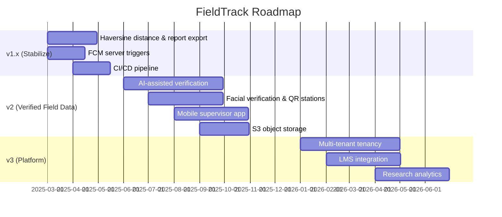

# 20 · Future Improvements

> 🎓 **Audience:** Academic / project readers, product owners, architects

---

## 1. Short-Term Enhancements (v1.x)

| # | Enhancement | Description | Value |
|---|-------------|-------------|-------|
| 1 | **Haversine distance** | Compute actual `distanceTravelled` from location pings on check-out | Accurate field metrics |
| 2 | **CSV/PDF report export** | Full client-side export of supervisor reports (currently server returns `logSummary`) | Offline reporting |
| 3 | **Server-side push triggers** | Send FCM push on notification creation (check-in, review, approval) | Real-time alerts |
| 4 | **iOS build** | Build & sign the Flutter app for iOS | Wider device support |
| 5 | **Production migrations** | Commit `prisma/migrations/` and use `migrate deploy` | Reliable schema upgrades |
| 6 | **CI/CD pipeline** | GitHub Actions for analyze/test/build; auto-deploy | Quality + velocity |

---

## 2. Mid-Term Enhancements (v2)

### 2.1 AI-Assisted Activity Verification
- **Image analysis** to detect whether field photos plausibly match the reported activity (e.g., vegetation, water, soil).
- **Anomaly detection** on GPS trails (speed, dwell, off-campus patterns).
- **Duplicate/consistency checks** between logs, evidence, and timestamps.

### 2.2 Facial Verification
- Match student selfie to their profile photo at **check-in** to prevent buddy check-ins.
- On-device liveness detection.

### 2.3 Digital Signatures
- Students and supervisors sign activity reports digitally (cryptographic signature capture).

### 2.4 QR Code Field Validation
- Generate **QR codes** for predefined field stations; students scan at the station to prove presence.
- Offline-safe: QR tokens validated on next sync.

### 2.5 IoT Sensor Integration
- Connect environmental sensors (temperature, pH, air quality) to field sessions via BLE.
- Auto-attach sensor readings to activity logs.

### 2.6 Mobile Supervisor Application
- Full supervisor experience on mobile (currently desktop/web-focused UI).

### 2.7 Cloud Object Storage
- Migrate from local disk to **S3-compatible storage** (presigned uploads, CDN).
- Reduces server I/O and improves media scalability.

---

## 3. Long-Term Enhancements (v3)

### 3.1 Advanced Dashboards & Analytics
- Institutional analytics portal with exportable charts.
- Supervisor workload balancing and student progress prediction.

### 3.2 Research Analytics
- Aggregated (anonymized) research data analytics for faculty.
- Integration with data repositories.

### 3.3 LMS Integration
- Moodle / Learning Management System integration for coursework workflows.
- Automatic grade export for field-practice components.

### 3.4 Multi-University Tenancy
- One deployment serving many universities with full data isolation and per-tenant branding.
- See [13_Multi_Tenant_Architecture.md](./13_Multi_Tenant_Architecture.md).

### 3.5 Offline Conflict Resolution UI
- User-friendly screen to resolve sync conflicts instead of silently dropping 409s.
- Field-level last-write-wins + revision history.

### 3.6 Push Notification Enhancements
- Notification categories, quiet hours enforcement server-side, deep links.

### 3.7 Native Offline Map
- Bundle map tiles for offline field maps in remote areas.

### 3.8 Multi-Language Support
- i18n for English + Swahili and other regional languages (preferences already include `prefLanguage`).

---

## 4. Prioritized Roadmap

---

## 5. Success Metrics for Future Work

| Feature | Success metric |
|---------|----------------|
| AI verification | ≥ 90% of flagged anomalies confirmed by manual review |
| QR field validation | ≥ 95% of students complete ≥ 90% of assigned stations |
| Offline conflict UI | 0 silent data-loss incidents during sync |
| Multi-tenant | Onboard 3 universities within 6 months of release |

